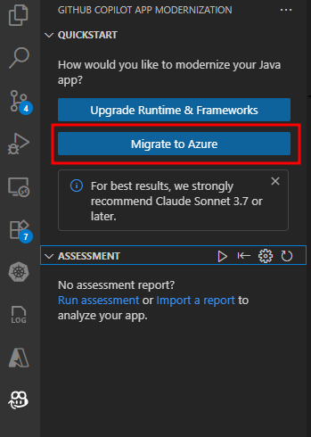
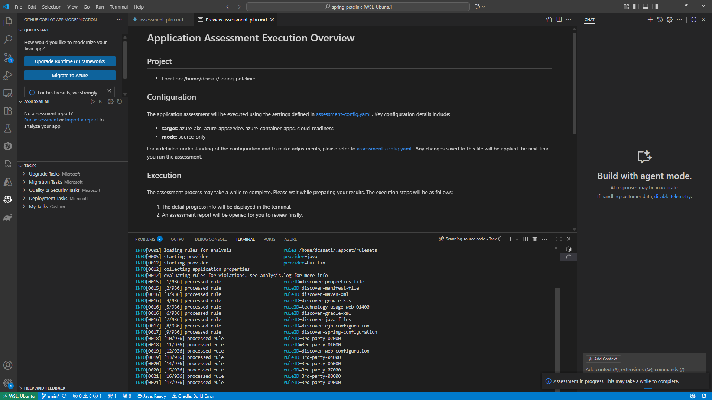
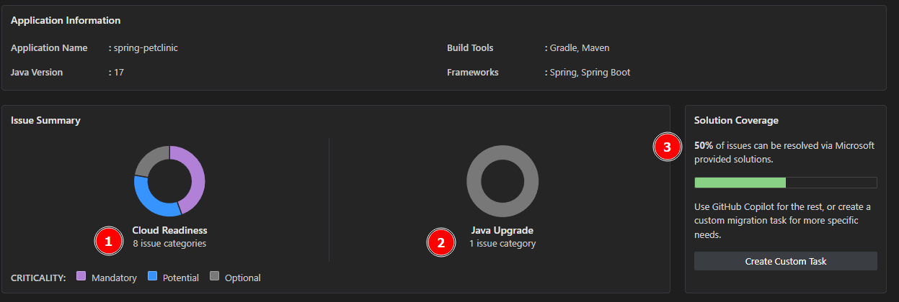
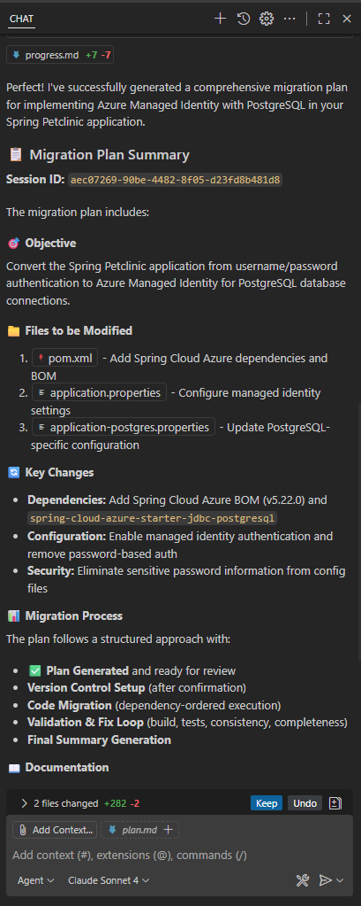
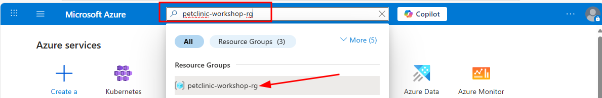
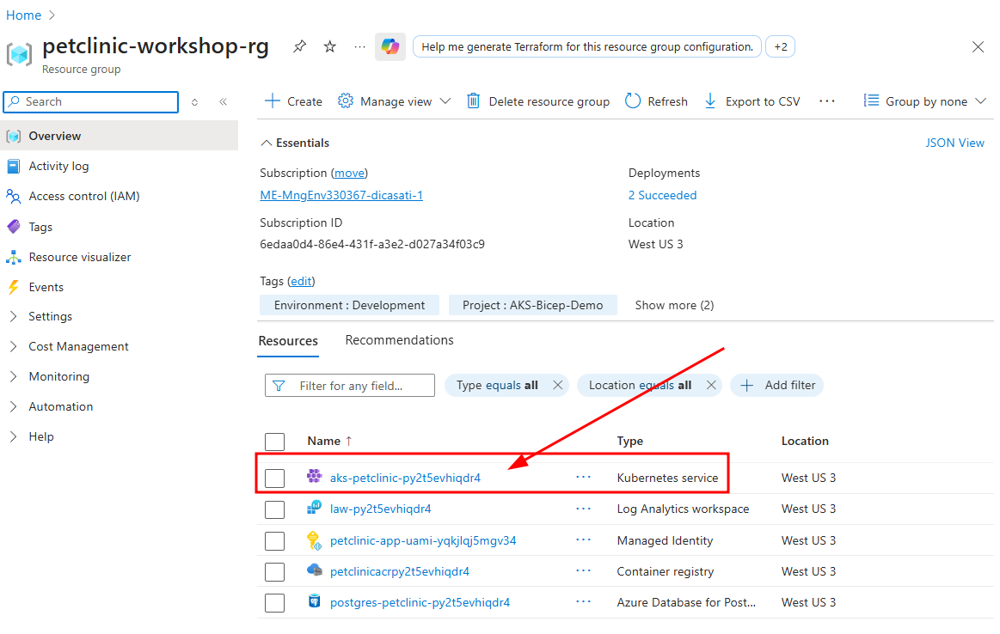
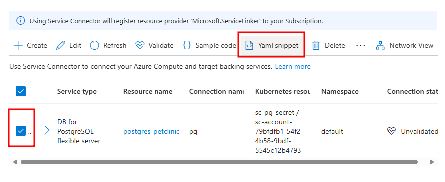

# Spring Boot PetClinic Migration & Modernization Workshop

This workshop demonstrates how to migrate and modernize the iconic Spring Boot PetClinic application from local execution to cloud deployment on Azure AKS Automatic. Participants will experience the complete modernization journey using AI-powered tools: GitHub Copilot app modernization and Containerization Assist MCP Server.

## Workshop Goals

Simulate on‑prem execution by running [Spring Boot PetClinic](https://github.com/spring-projects/spring-petclinic) locally with PostgreSQL and basic auth, modernize the code with [GitHub Copilot app modernization](https://marketplace.visualstudio.com/items?itemName=vscjava.migrate-java-to-azure), migrate to [Azure PostgreSQL Flexible Server](https://learn.microsoft.com/azure/postgresql/flexible-server/) using [Microsoft Entra ID](https://learn.microsoft.com/en-us/azure/active-directory/), containerize with Containerization Assist MCP Server to generate Docker and Kubernetes manifests, and deploy to [AKS Automatic](https://learn.microsoft.com/azure/aks/automatic/) with [workload identity](https://learn.microsoft.com/en-us/azure/aks/workload-identity-overview) and [Service Connector](https://learn.microsoft.com/azure/service-connector/).

## Workshop Structure

```
~/mm-springboot-petclinic-to-aks-automatic/
├── README.md                           # This file - Complete workshop guide
├── plan.md                             # Detailed workshop plan (temporary)
├── infra/                              # Infrastructure and automation
│   ├── setup-local-lab-infra.sh        # One-command workshop setup
├── src/                                # Symlink to ~/spring-petclinic
├── manifests/                          # Generated Kubernetes manifests (empty initially)
├── config/                             # Configuration files (empty initially)
└── images/                             # Workshop screenshots and diagrams

~/spring-petclinic/                     # Spring PetClinic repository
├── src/main/java/                      # Java source code (modernized during workshop)
├── src/main/resources/                 # Application properties and configuration
├── pom.xml                             # Maven dependencies
└── ...                                 # Other Spring Boot PetClinic files
```

### Prerequisites Check
Ensure you have the following tools installed and available:
- [Azure CLI](https://learn.microsoft.com/en-us/cli/azure/install-azure-cli) (logged in with `az login`)
- [Java 17 or 21](https://learn.microsoft.com/en-us/java/openjdk/download) (Microsoft OpenJDK)
- Maven 3.8+.
- Docker Desktop or equivalent.
- [VS Code with Java Extension Pack](https://marketplace.visualstudio.com/items?itemName=vscjava.vscode-java-pack)
- [GitHub Copilot app modernization Extension Pack](https://marketplace.visualstudio.com/items?itemName=vscjava.vscode-java-upgrade)
- [kubectl](https://learn.microsoft.com/en-us/azure/aks/learn/quick-kubernetes-deploy-cli#install-the-azure-cli-and-kubernetes-cli) (available via Azure AKS client tools).
- A terminal with `bash` (e.g.: Windows Terminal with WSL, macOS or Linux).

===

## Module 1: Set Up and Test PetClinic Locally

**What You'll Do:** Set up a complete local development environment with the PetClinic application running against PostgreSQL, then explore the application in your browser.

**What You'll Learn:** How to quickly deploy a local Spring Boot development environment with Docker-based PostgreSQL and verify application functionality.

### Step 1: Run the Automated Setup Script

The `setup-local-lab-infra.sh` script performs a complete one-command setup:

1. **Clones the repository** to `~/spring-petclinic` and creates a symlink for easy access
2. **Launches PostgreSQL** in a Docker container with pre-configured credentials
3. **Builds and starts** the Spring Boot application connected to the database

Execute the setup script from the `infra` directory:

```bash
cd infra
chmod +x setup-local-lab-infra.sh
./setup-local-lab-infra.sh
```

The script will complete in approximately 1-2 minutes. When finished, your PetClinic application will be running at **http://localhost:8080**.

### Step 2: Verify the Application

Open your browser and navigate to `http://localhost:8080` to confirm the application is running. 

*** Explore the PetClinic Application:**

Once the application is running in your browser, take some time to explore the functionality:

- **Find Owners**: Go to "FIND OWNERS" → leave the "Last Name" field blank → click "Find Owner" to see all 10 owners.

- **View Owner Details**: Click on an owner like "Betty Davis" to see their information and pets.

- **Edit Pet Information**: From an owner's page, click "Edit Pet" to see how pet details are managed.

- **Review Veterinarians**: Navigate to "VETERINARIANS" to see the 6 vets with their specialties (radiology, surgery, dentistry).

### Step 3: Open the Project in VS Code

Next, let's open the Petclinic project in a new instance of VS Code and begin our modernization work. In VS Code, open a terminal and run the following command to launch a new VS Code instance into the `spring-petclinic` source directory:
   
```bash
  code ~/spring-petclinic
```

===

## Module 2: Application Modernization

**What You'll Do:** Use GitHub Copilot app modernization to assess, remediate, and modernize the Spring Boot application in preparation to migrate the workload to AKS Automatic.

**What You'll Learn:** How GitHub Copilot app modernization works, demonstration of modernizing elements of legacy applications, and the modernization workflow

**Detailed Steps:**

### Step 1: Select the GitHub Copilot app modernization extension
After VS Code opens with the Spring PetClinic project in focus, select the **GitHub Copilot app modernization** extension from the Activity Bar.


### Step 2: Navigate the Extension Interface
You'll see the extension interface with two main sections: **QUICKSTART** and **ASSESSMENT**. Click **Migrate to Azure** to begin the modernization process.



### Step 3: Review Code Assessment Configuration Options
Scroll down in the GitHub Copilot chat to see the Assessment tool configuration represented as JSON. 

**Configuration Options:**
The tool offers several analysis targets and modes:

**Analysis Targets:**

- `azure-aks` - Selects AppCAT rules relevant to moving pre-containerized workloads to AKS.
- `openjdk17` - Identifies Java 17 upgrade opportunities and compatibility issues.
- `cloud-readiness` - General pre-container workload optimization recommendations.

**Analysis Modes:**
- `source-only` - Analyzes source code without dependency scanning (faster execution).
- `full` - Comprehensive analysis including both code and dependency scanning.

The results of the Assessment scan are passed into GitHub Copilot app modernization which uses the context of the findings to suggest opportunities for modernization in preparation for containerizing and migrating the workload to Azure.


The AppCAT tool will run with the following options:

```
appcat:
  - target:
      - azure-aks
      - azure-appservice
      - azure-container-apps
      - cloud-readiness
    mode: source-only
```

You can change these options in the `.github/appmod-java/appcat/assessment-config.yaml` file.

### Step 4: Execute Assessment
Click the "Run" button to start the assessment. The tool will analyze your Spring Boot PetClinic application using the configured analysis parameters.



### Step 5: Review Assessment Results
After the assessment completes, you'll see a success message in the GitHub Copilot chat summarizing what was accomplished:


The assessment analyzed the Spring Boot Petclinic application for cloud migration readiness and identified the following:

Key Findings:

* 8 cloud readiness issues requiring attention (1)
* 1 Java upgrade opportunity for modernization (2)





**Resolution Approach:** More than 50% of the identified issues can be automatically resolved through code and configuration updates using GitHub Copilot's built-in app modernization capabilities (3).

**Issue Prioritization:** Issues are categorized by urgency level to guide remediation efforts:

* Mandatory (Purple) - Critical issues that must be addressed before migration.
* Potential (Blue) - Performance and optimization opportunities.
* Optional (Gray) - Nice-to-have improvements that can be addressed later.

This prioritization framework ensures teams focus on blocking issues first while identifying opportunities for optimization and future enhancements.

### Step 6: Review Specific Findings

Click on individual issues in the report to see detailed recommendations. In practice, you would review all recommendations and determine the set that aligns with your migration and modernization goals for the application.

For this lab, we will spend our time focusing on one modernization recommendation: updating the code to use modern authentication via Azure Database for PostgreSQL Flexible Server with Entra ID authentication.


| Aspect | Details |
|--------|---------|
| **Modernization Lab Focus** | Database Migration to Azure PostgreSQL Flexible Server |
| **What was found** | PostgreSQL database configuration using basic authentication detected in Java source code files |
| **Why this matters** | External dependencies like on-premises databases with legacy authentication must be resolved before migrating to Azure |
| **Recommended solution** | Migrate to Azure Database for PostgreSQL Flexible Server |
| **Benefits** | Fully managed service with automatic backups, scaling, and high availability |

### Step 7: Take Action on Findings

Based on the assessment findings, GitHub Copilot app modernization provides two types of migration actions to assist with modernization opportunities. 

1. Using the **guided migrations** ("Run Task" button), which offer fully guided, step-by-step remediation flows for common migration patterns that the tool has been trained to handle. 
2. Using the **unguided migrations** ("Ask Copilot" button), which provide AI assistance with context aware guidance and code suggestions for more complex or custom scenarios.


For this workshop, we'll focus on one modernization area that demonstrates how to externalize dependencies in the workload to Azure PaaS before deploying to AKS Automatic. We'll migrate from self-hosted PostgreSQL with basic authentication to Azure PostgreSQL Flexible Server using Entra ID authentication with AKS Workload Identity.

### Step 8: Select PostgreSQL Migration Task

Begin the modernization by selecting the desired migration task. For our Spring Boot application, we will migrate to Azure PostgreSQL Flexible Server using the Spring option. The other options shown are for generic JDBC usage.


**Note:** Choose the "Spring" option for Spring Boot applications, as it provides Spring-specific optimizations and configurations. The generic JDBC options are for non-Spring applications.

### Step 9: Execute Postgres Migration Task

Click the **Run Task** button described in the previous section to kick off the modernization changes needed in the PetClinic app. This will update the Java code to work with PostgreSQL Flexible Server using Entra ID authentication.


The tool will execute the `appmod-run-task` command for `managed-identity-spring/mi-postgresql-spring`, which will examine the workspace structure and initiate the migration task to modernize your Spring Boot application for Azure PostgreSQL with managed identity authentication. If prompted to run shell commands, please review and allow each command as the Agent may require additional context before execution.

When the migration task for PostgreSQL with Entra ID authentication begins to run, you will see a chat similar to this in the agent interface:


### Step 10: Review Migration Plan and Begin Code Migration

The App Modernization tool has analyzed your Spring Boot application and generated a comprehensive migration plan in its chat window and in the `plan.md` file. This plan outlines the specific changes needed to implement Azure Managed Identity authentication for PostgreSQL connectivity.



**Azure Postgres Flexible Server Migration Plan Overview:**
- **Add Spring Cloud Azure Dependencies**: Integrate Spring Cloud Azure BOM version 5.22.0 and the `spring-cloud-azure-starter-jdbc-postgresql` dependency to both Maven and Gradle build files.
- **Configure Managed Identity Authentication**: Update application configuration files to replace username/password authentication with Azure Managed Identity, enabling passwordless database connectivity.

**Files to be Modified:**
- `pom.xml` and `build.gradle` - Add Spring Cloud Azure dependencies
- `application.properties` and `application-postgres.properties` - Configure managed identity authentication settings

**Migration Tracking:**
The tool will create tracking files (`plan.md` and `progress.md`) in the `.github/appmod-java/code-migration/managed-identity-spring/mi-postgresql-spring-[timestamp]` directory to document all changes and provide full visibility into the AI assisted code refactoring migration process.

**Version Control Setup:**
- A new Git branch will be created for the migration work.
- Uncommitted changes will be automatically stashed.
- Migration session ID will be provided for tracking.

To Begin Migration type **"Yes"** in the GitHub Agent Chat to start the code refactoring.

### Step 11: Review Migration Process and Progress Tracking
Once you confirm with "Yes", the migration tool begins implementing changes using a structured, two-phase approach designed to ensure traceability and commit changes to a new dedicated code branch for changes to enable rollback if needed.

**Version Control Setup:**
The tool automatically manages version control to ensure your work is protected:
- **Stash uncommitted changes**: Any local modifications (like `application.properties` changes) are safely stashed.
- **Create dedicated branch**: New branch `appmod/java-managed-identity-spring/mi-postgresql-spring-[timestamp]` is created for all code refactoring migration work.

**Two-Phase Migration Process:**

**Phase 1: Update Dependencies**
- **Purpose**: Add the necessary Azure libraries to your project.
- **Changes made**:
  - Updates `pom.xml` with Spring Cloud Azure BOM and PostgreSQL starter dependency
  - Updates `build.gradle` with corresponding Gradle dependencies
  - Adds Spring Cloud Azure version properties.

**Phase 2: Configure Application Properties**
- **Purpose**: Update configuration files to use managed identity authentication.
- **Changes made**:
  - Updates `application.properties` to configure PostgreSQL with managed identity (9 lines added, 2 removed)
  - Updates `application-postgres.properties` with Entra ID authentication settings (5 lines added, 4 removed)
  - Replaces username/password authentication with managed identity configuration.

**Progress Tracking:**
The `progress.md` file provides real-time visibility into the migration process:
- **Change documentation**: Detailed log of what changes are being made and why.
- **File modifications**: Clear tracking of which files are being updated.
- **Rationale**: Explanation of the reasoning behind each modification.
- **Status updates**: Real-time progress of the migration work.

**How to Monitor Progress:**
- Watch the GitHub Copilot chat for real-time status updates
- Check the `progress.md` file in the migration directory for detailed change logs
- Review the `plan.md` file to understand the complete migration strategy
- Monitor the terminal output for any build or dependency resolution messages

### Step 12: Validation and Fix Iteration Loop
After implementing the migration changes, the App Modernization tool automatically validates the results through a comprehensive testing process to ensure the migration changes are secure, functional, and consistent.


*Figure: Execute Validation & Fix Iteration Loop - CVE validation process for newly added Azure Spring dependencies*

**Validation Stages:**

| Stage | Validation | Details |
|--------|---------|---------
| 1 | **CVE Validation** | Scans newly added dependencies for known security vulnerabilities.
| 2 | **Build Validation** | Verifies the application compiles and builds successfully after migration changes.
| 3 | **Consistency Validation** | Ensures all configuration files are properly updated and consistent.
| 4 | **Test Validation** | Executes application tests to verify functionality remains intact.

**Automated Error Detection and Resolution:**
The tool includes intelligent error detection capabilities that automatically identify and resolve common issues:
- Parses build output to detect compilation errors.
- Identifies root causes of test failures.
- Applies automated fixes for common migration issues.
- Continues through validation iterations (up to 10 iterations) until the build succeeds

**User Control:**
At any point during this validation process, you may interrupt the automated fixes and manually resolve issues if you prefer to handle specific problems yourself. The tool provides clear feedback on what it's attempting to fix and allows you to take control when needed at any time.

This systematic approach ensures your Spring Boot application is successfully modernized for Azure PostgreSQL with Entra ID authentication while maintaining full functionality.

### Step 13: Review Migration Completion Summary
Upon successful completion of the validation process, the App Modernization tool presents a comprehensive migration summary report confirming the successful implementation of Azure Managed Identity authentication for PostgreSQL in your Spring Boot application.


The migration has successfully transformed your application from password-based Postgres authentication to Azure Managed Identity for PostgreSQL, removing the need for credentials in code while maintaining application functionality. The process integrated Spring Cloud Azure dependencies, updated configuration properties for managed identity authentication, and ensured all validation stages passed including CVE scanning, build validation, consistency checks, and test execution.

Because the workload is based on Java Spring Boot, an advantage of this migration is that no Java code changes were required. Spring Boot's configuration-driven architecture automatically handles database connection details based on the configuration files. When switching from password authentication to managed identity, Spring reads the updated configuration and automatically uses the appropriate authentication method. Your existing Java code for database operations (such as saving pet records or retrieving owner information) continues to function as before, but now connects to the database using the more secure managed identity approach.

**Files Modified:**

The migration process updated the following configuration files:
- `pom.xml` and `build.gradle` - Added Spring Cloud Azure dependencies
- `application.properties` and `application-postgres.properties` - Configured managed identity authentication
- Test configurations - Updated to work with the new authentication method

**Version Control Integration:**
All changes were automatically committed to a new branch (`appmod/java-managed-identity-spring/mi-postgresql-spring-[timestamp]`) with supporting documentation including migration plan (`plan.md`), progress tracking (`progress.md`), and final summary (`summary.md`) files for complete visibility into the migration process and outcomes.

===

## Module 3: Generate Containerization Assets

**What You'll Do:** Use AI-powered containerization tools to create Docker and Kubernetes manifests for the modernized Spring Boot application.

**What You'll Learn:** How AI-powered tools can generate production-ready containerization assets, including optimized Dockerfiles and Kubernetes deployment manifests with proper health checks and service configurations.

**Detailed Steps:**

### Step 1: Install Containerization Assist MCP Server

For the next steps we will use the [Containerization Assist MCP Server](https://github.com/Azure/containerization-assist). Open a new instance of VS Code and navigate to the PetClinic project:

```bash
# Open a new VS Code window with the src folder
code src/
```

Install the Containerization Assist MCP Server globally. Open a terminal and run:

```bash
npm install -g @thgamble/containerization-assist-mcp@latest
```

Configure VS Code to use the MCP server. Add to your VS Code settings or create `.vscode/mcp.json` in your project:

```json
{
  "servers": {
    "containerization-assist": {
      "command": "containerization-assist-mcp",
      "args": ["start"],
      "env": {
        "DOCKER_SOCKET": "/var/run/docker.sock",
        "LOG_LEVEL": "info"
      }
    }
  }
}
```

Restart VS Code to enable the MCP server in GitHub Copilot.

**Validation:** After restarting VS Code, you should see the Containerization Assist MCP Server available in the Configure Tools dialog:


### Step 2: Generate Containerization Assets with AI

In the GitHub Copilot agent chat, use the following prompt to generate production-ready Docker and Kubernetes manifests:

```
Help me containerize the application at ./src and generate Kubernetes deployment artifacts using Containerization Assist. Put all of the kubernetes files in a directory called k8s. 

PostgreSQL Configuration via Azure Service Connector:
- Reference secret: sc-pg-secret
- Map these secret keys to environment variables:
  - AZURE_POSTGRESQL_HOST
  - AZURE_POSTGRESQL_PORT
  - AZURE_POSTGRESQL_DATABASE
  - AZURE_POSTGRESQL_CLIENTID (map to both AZURE_CLIENT_ID and AZURE_MANAGED_IDENTITY_NAME)
  - AZURE_POSTGRESQL_USERNAME

Health Checks:
- Liveness probe: /actuator/health
- Readiness probe: /actuator/health

Also include:
- A LoadBalancer Service exposing port 80 (targeting container port 8080)
- Keep envFrom with secretRef to make all secret keys available in the pod
```

The Containerization Assist MCP Server will analyze your repository and generate:

- **Dockerfile**: Multi-stage build with optimized base image

- **Kubernetes Deployment**: With Azure workload identity, PostgreSQL secrets, health checks, and resource limits

- **Kubernetes Service**: LoadBalancer configuration for external access

**Expected Result**: Production-ready containerization assets in the `k8s/` directory.

===

### Module 5: Deploy to AKS

**What You'll Do:** Deploy the modernized application to AKS Automatic using Service Connector secrets for passwordless authentication with PostgreSQL.

**What You'll Learn:** Kubernetes deployment with workload identity, Service Connector integration, and testing deployed applications with Entra ID authentication.

**Detailed Steps:**

### Step 1: Access AKS Service Connector and Retrieve PostgreSQL Configuration
Navigate to your AKS cluster in the Azure Portal and access the Service Connector blade to retrieve the PostgreSQL connection configuration.

1. **[Open Azure Portal](https://portal.azure.com/)** and sign in to your Azure account
2. **Navigate to Resource Group**: In the search bar, type "petclinic-workshop-rg" and select the resource group that was created by the setup script


3. **Find AKS Cluster**: In the resource group, locate your AKS cluster (it will have a name like `petclinic-workshop-aks-xxxxxx` where xxxxxx is a random suffix)


4. **Open AKS Cluster**: Click on the AKS cluster name to open the cluster overview page
5. **Access Service Connector**: In the left menu under "Settings", click on "Service Connector"


6. **View Service Connections**: You'll see the service connection that was automatically created:
   - **PostgreSQL connection** with name "pg" connecting to your PostgreSQL flexible server.
7. **Generate YAML Snippet**: Select the PostgreSQL connection row (the one with "DB for PostgreSQL flexible server") and click the "Sample code" button in the action bar


### Step 2: Retrieve PostgreSQL YAML Configuration
The Azure Portal will display a YAML snippet showing how to use the Service Connector secrets for PostgreSQL connectivity.

1. **Review YAML Snippet**: The portal shows a sample deployment with workload identity configuration
2. **Note Key Elements**:
   - Service account: `sc-account-d4157fc8-73b5-4a68-acf4-39c8f22db792`
   - Secret reference: `sc-pg-secret`
   - Workload identity label: `azure.workload.identity/use: "true"`


### Step 3: Create Final Kubernetes Deployment Manifest
Create a comprehensive deployment manifest that combines the PetClinic application with PostgreSQL Service Connector configuration:

```yaml
apiVersion: apps/v1
kind: Deployment
metadata:
  namespace: default
  name: petclinic-deployment
  labels:
    app: petclinic
spec:
  replicas: 2
  selector:
    matchLabels:
      app: petclinic
  template:
    metadata:
      labels:
        app: petclinic
        azure.workload.identity/use: "true"
    spec:
      serviceAccountName: sc-account-d4157fc8-73b5-4a68-acf4-39c8f22db792
      containers:
      - name: petclinic
        image: <acr-login-server>/petclinic:latest
        ports:
        - containerPort: 8080
        env:
        - name: SPRING_PROFILES_ACTIVE
          value: "postgres"
        - name: DATABASE
          value: "postgres"
        envFrom:
        - secretRef:
            name: sc-pg-secret
        livenessProbe:
          httpGet:
            path: /actuator/health
            port: 8080
          initialDelaySeconds: 60
          periodSeconds: 30
        readinessProbe:
          httpGet:
            path: /actuator/health
            port: 8080
          initialDelaySeconds: 30
          periodSeconds: 10
        resources:
          requests:
            memory: "512Mi"
            cpu: "250m"
          limits:
            memory: "1Gi"
            cpu: "500m"
      restartPolicy: Always
---
apiVersion: v1
kind: Service
metadata:
  name: petclinic-service
  namespace: default
spec:
  selector:
    app: petclinic
  ports:
  - port: 80
    targetPort: 8080
  type: ClusterIP
```

### Step 5: Build and Push Container Image to ACR
Build the containerized application and push it to your Azure Container Registry:

```bash
# load your azure.env file from the
# mm-springboot-petclinic-to-aks-automatic-ignite/infra

source ~/mm-springboot-petclinic-to-aks-automatic-ignite/infra/azure.env
echo "ACR Login Server: $ACR_LOGIN_SERVER"

# Login to ACR using Azure CLI
az acr login --name ${ACR_NAME}

# Build the Docker image
docker build -t petclinic:latest .

# Tag the image for ACR
docker tag petclinic:latest $ACR_LOGIN_SERVER/petclinic:latest

# Push the image to ACR
docker push $ACR_LOGIN_SERVER/petclinic:latest
```

### Step 6: Configure Azure RBAC Authentication for kubectl
Before deploying to AKS, you need to configure kubectl to use Azure RBAC authentication:

```bash
# Get AKS credentials (this downloads the kubeconfig)
az aks get-credentials --resource-group ${RESOURCE_GROUP_NAME} --name ${AKS_CLUSTER_NAME}

# Configure kubectl to use Azure RBAC authentication
kubelogin convert-kubeconfig --login azurecli

# Test AKS access
kubectl get pods
```

**Note:** The `kubelogin convert-kubeconfig --login azurecli` command configures kubectl to use Entra (Azure AD) authentication with the Azure RBAC roles assigned to your user account. This is required for AKS Automatic clusters with Azure RBAC enabled.

### Step 7: Deploy to AKS
Apply the Kubernetes manifests to deploy the application:

```bash
# Update the deployment manifest with your ACR login server
sed -i "s/<acr-login-server>/$ACR_LOGIN_SERVER/g" k8s/petclinic-deployment.yaml

# Apply the deployment manifest
kubectl apply -f k8s/petclinic-deployment.yaml

# Monitor deployment status
kubectl get pods,services,deployments -w
```

It might take a minute for the AKS Automatic cluster to provision new nodes for the workload so it is normal to see your pods in a `Pending` state until the new nodes are available:

```bash
NAME                                    READY   STATUS              RESTARTS   AGE
petclinic-deployment-5f9db48c65-qpb8l   0/1     Pending             0          2m2s
petclinic-deployment-5f9db48c65-vqb8x   0/1     Pending             0          2m2s
```

### Step 8: Verify Deployment and Connectivity
Test the deployed application and verify Entra ID authentication:

```bash
# Port forward to access the application
kubectl port-forward svc/petclinic-service 8080:80

# Test the application (in another terminal)
curl http://localhost:8080

# Check pod logs for successful database connections
kubectl logs -l app=petclinic

# Verify health endpoints
curl http://localhost:8080/actuator/health
```

### Step 9: Validate Entra ID Authentication
Verify that the application is using passwordless authentication:

```bash
# Check environment variables in the pod (get first pod with label)
POD_NAME=$(kubectl get pods -l app=petclinic -o jsonpath='{.items[0].metadata.name}')
kubectl exec $POD_NAME -- env | grep POSTGRES

# Verify no password environment variables are present
kubectl exec $POD_NAME -- env | grep -i pass

# Check application logs for successful authentication
kubectl logs -l app=petclinic --tail=100 | grep -i "connected\|authenticated"
```

**Expected Result**: Application successfully deployed to AKS with passwordless authentication to PostgreSQL using Entra ID and workload identity.

**Happy modernizing!**
