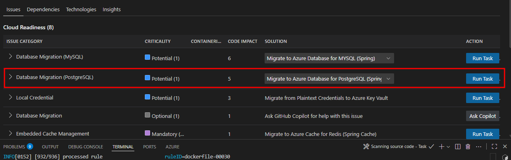
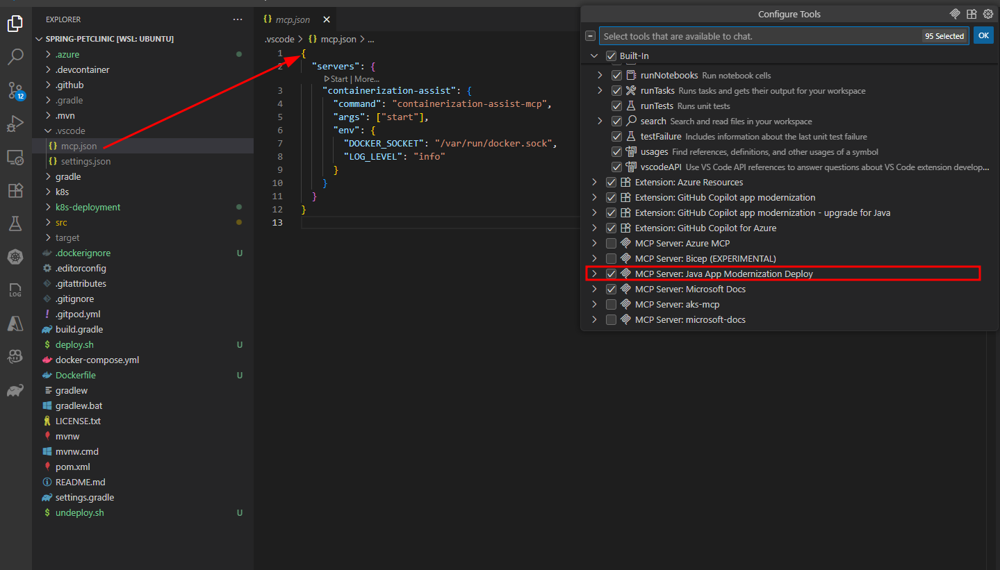
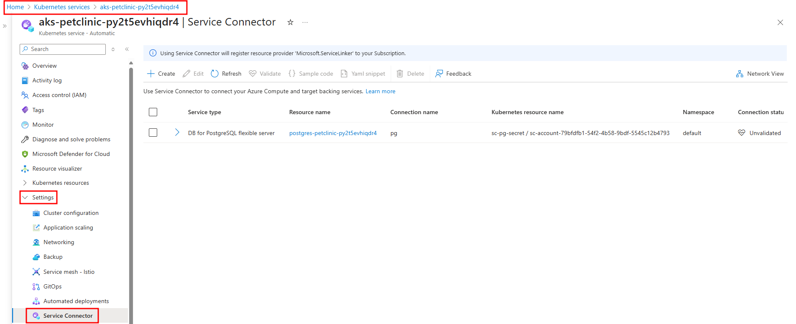

# Spring Boot PetClinic Migration & Modernization Workshop

This workshop demonstrates how to migrate and modernize the iconic Spring Boot PetClinic application from local execution to cloud deployment on Azure AKS Automatic. Participants will experience the complete modernization journey using AI-powered tools: GitHub Copilot app modernization and Containerization Assist MCP Server.

## 🎯 Workshop Goals

Simulate on‑prem execution by running [Spring Boot PetClinic](https://github.com/spring-projects/spring-petclinic) locally with PostgreSQL and basic auth, modernize the code with [GitHub Copilot app modernization](https://marketplace.visualstudio.com/items?itemName=vscjava.migrate-java-to-azure), migrate to [Azure PostgreSQL Flexible Server](https://learn.microsoft.com/azure/postgresql/flexible-server/) using [Microsoft Entra ID](https://learn.microsoft.com/en-us/azure/active-directory/), containerize with Containerization Assist MCP Server to generate Docker and Kubernetes manifests, and deploy to [AKS Automatic](https://learn.microsoft.com/azure/aks/automatic/) with [workload identity](https://learn.microsoft.com/en-us/azure/aks/workload-identity-overview) and [Service Connector](https://learn.microsoft.com/azure/service-connector/).

## 📁 Workshop Structure

```
~/mm-springboot-petclinic-to-aks-automatic/
├── README.md                           # This file - Complete workshop guide
├── plan.md                             # Detailed workshop plan (temporary)
├── infra/                              # Infrastructure and automation
│   ├── setup-local-lab-infra.sh        # One-command workshop setup
│   └── setup-azure-infra.sh            # Azure resource deployment script
├── src/                                # Symlink to ~/spring-petclinic (your forked repository)
├── manifests/                          # Generated Kubernetes manifests (empty initially)
├── config/                             # Configuration files (empty initially)
└── images/                             # Workshop screenshots and diagrams

~/spring-petclinic/                     # Your forked Spring PetClinic repository
├── src/main/java/                      # Java source code (modernized during workshop)
├── src/main/resources/                 # Application properties and configuration
├── pom.xml                             # Maven dependencies
└── ...                                 # Other Spring Boot PetClinic files
```

### Prerequisites Check
Ensure you have the following tools installed and available:
- [Azure CLI](https://learn.microsoft.com/en-us/cli/azure/install-azure-cli) (logged in with `az login`)
- [Java 17 or 21](https://learn.microsoft.com/en-us/java/openjdk/download) (Microsoft OpenJDK)
- Maven 3.8+
- Docker Desktop or equivalent
- [VS Code with Java Extension Pack](https://marketplace.visualstudio.com/items?itemName=vscjava.vscode-java-pack)
- [GitHub Copilot app modernization Extension Pack](https://marketplace.visualstudio.com/items?itemName=vscjava.vscode-java-upgrade)
- [kubectl](https://learn.microsoft.com/en-us/azure/aks/learn/quick-kubernetes-deploy-cli#install-the-azure-cli-and-kubernetes-cli) (available via Azure AKS client tools)
- Bash/Zsh shell (macOS or Linux)

### Module 1: Deploy Azure Infrastructure

In this module, you will create all required Azure resources using Bicep templates and learn about Azure resource management, PostgreSQL Flexible Server, AKS Automatic, and workload identity concepts.

**What You'll Do:** Deploy Azure infrastructure using Bicep templates to support the Petclinic application.

**What You'll Learn:** Azure Bicep deployment, AKS Automatic, PostgreSQL Flexible Server with Entra ID, and Service Linkers.

AKS Automatic is a great landing zone to migrate and modernize legacy workloads because it simplifies by default: AKS manages node provisioning and scaling, applies hardened security baselines, enables Azure RBAC and workload identity, and integrates application routing (managed NGINX) and observability out of the box letting teams focus on the app, not managing the cluster.

Modernizing legacy workloads pairs naturally with Azure PaaS: replace the simulated on‑prem PostgreSQL with Azure Database for PostgreSQL Flexible Server using Microsoft Entra authentication for passwordless access from AKS, and use AKS Service Connector to generate the Kubernetes wiring and secrets that connect and authenticate the app to Postgres automatically.

See the AKS Automatic overview and engineering deep dive for details, and service docs for Entra-enabled Postgres and Service Connector: [AKS Automatic intro](https://learn.microsoft.com/en-us/azure/aks/intro-aks-automatic), [AKS Automatic engineering blog](https://blog.aks.azure.com/2024/05/22/aks-automatic).

**Detailed Steps:**

### Step 1: Open Terminal in VS Code
If you haven't already, open a new terminal in VS Code:
- Press ``Ctrl+` `` (backtick) on Windows/Linux or ``Cmd+` `` on macOS
- Or go to **Terminal** → **New Terminal** in the menu
- Or use the Command Palette (`Ctrl+Shift+P` / `Cmd+Shift+P`) and search for "Terminal: Create New Terminal"

### Step 2: Navigate to Infrastructure Directory
```bash
cd infra
```

### Step 3: Verify Prerequisites
```bash
# Check Azure CLI is installed and you're logged in
az account show

# If not logged in, run:
az login
```

### Step 4: Review Bicep Configuration
```bash
# View the main Bicep template
cat main.bicep

# View the parameters file
cat parameters.json

# View the resources template
cat resources.bicep
```

### Step 6: Deploy Azure Infrastructure
```bash
# Make the deployment script executable
chmod +x setup-azure-infra.sh

# Run the deployment in the background (this will take 30 minutes)
./setup-azure-infra.sh > deployment.log 2>&1 &
```

> **Note:** The Azure infrastructure deployment is now running in the background and will take approximately 30 minutes to complete. You can follow the deployment progress by looking at the `deployment.log` file (e.g.: `tail deployment.log`).
>
> While it's deploying, you will continue with Module 2 to set up the PetClinic application locally and begin the modernization work.

**What this script creates in Azure:**
- Resource group: `petclinic-workshop-rg`
- AKS Automatic cluster with system-assigned managed identity
- Azure PostgreSQL Flexible Server with Entra ID authentication
- Log Analytics Workspace for AKS monitoring
- Service Connectors for secure AKS to Postgres connection and authentication using AKS workload identity
- User Assigned Managed Identity for application authentication

---

### Module 2: Setup Petclinic locally and test

**What You'll Do:** Fork the PetClinic repository, run the automated local lab setup, start the application against a local PostgreSQL instance, explore core app features in the browser, and open the project in VS Code to prepare for modernization.
**What You'll Learn:** How to prepare a local development environment, run Spring Boot with Maven using externalized Postgres configuration, validate application functionality, and navigate the PetClinic codebase in VS Code.

### Step 1: Fork the Spring PetClinic Repository
Before starting the workshop, you need to fork the Spring PetClinic repository to your own GitHub account:

1. **Navigate to the Spring PetClinic repository**: https://github.com/spring-projects/spring-petclinic
2. **Click the "Fork" button** in the top-right corner
3. **Select your GitHub account** as the destination for the fork
4. **Wait for the fork to complete** (usually takes a few seconds)
5. **Note your fork URL**: It will be `https://github.com/YOUR_USERNAME/spring-petclinic`

> **Important**: You must fork the repository to your own GitHub account because the workshop will make changes to the code that you'll want to commit and push to your fork.

### Step 2: Run the Automated Setup Script
Run the automated setup script with your fork URL:
   ```bash
   chmod +x setup-local-lab-infra.sh
   ./setup-local-lab-infra.sh https://github.com/YOUR_USERNAME/spring-petclinic
   ```
 
### Step 3: Test the Spring Petclinic Application Locally
Congratulations, your copy of the Spring Petclinic application should be running locally. You can test it by opening a browser to `http://localhost:8080`. 

If you need to run this manually:

   ```bash
   # Check if PostgreSQL container is running
   docker ps | grep petclinic-postgres
   
   # Test the application with all configuration
   cd src
   mvn spring-boot:run -Dspring-boot.run.arguments="--spring.messages.basename=messages/messages --spring.datasource.url=jdbc:postgresql://localhost/petclinic --spring.sql.init.mode=always --spring.sql.init.schema-locations=classpath:db/postgres/schema.sql --spring.sql.init.data-locations=classpath:db/postgres/data.sql --spring.jpa.hibernate.ddl-auto=none"
   cd ..
   
   # Wait for application to fully start
   echo "⏳ Waiting 30 seconds for application to start..."
   sleep 30

   # Open in browser for manual verification
   # http://localhost:8080

   ```

**💡 Explore the PetClinic Application:**
Once the application is running in your browser, take some time to explore the functionality:
- **Find Owners**: Go to "FIND OWNERS" → leave the "Last Name" field blank → click "Find Owner" to see all 10 owners
- **View Owner Details**: Click on an owner like "Betty Davis" to see their information and pets
- **Edit Pet Information**: From an owner's page, click "Edit Pet" to see how pet details are managed
- **Review Veterinarians**: Navigate to "VETERINARIANS" to see the 6 vets with their specialties (radiology, surgery, dentistry)

### Step 4: Open the Project in VS Code
Next, let's open the Petclinic project in a new instance of VS Code and begin our modernization work. Open a terminal and change to the `mm-springboot-petclinic-to-aks-automatic directory`. Run the following command to launch VS Code into the root of the lab contents:
   ```bash
   code ~/spring-petclinic
   ```

---

### Module 3: Application Modernization

**What You'll Do:** Use GitHub Copilot app modernization to assess, remediate, and modernize the Spring Boot application in preparation to migrate the workload to AKS Automatic.

**What You'll Learn:** How GitHub Copilot app modernization works, demonstration of modernizing elements of legacy applications, and the modernization workflow

**Detailed Steps:**

### Step 1: Select the GitHub Copilot app modernization Extension
After VS Code opens with the Spring PetClinic project in focus, select the GitHub Copilot app modernization extension from the Activity Bar (cloud icon with J and arrows).


### Step 2: Navigate the Extension Interface
You'll see the extension interface with two main sections: **QUICKSTART** and **ASSESSMENT**. Click **Migrate to Azure** to begin the modernization process.


> Note: At this stage, you might be prompted to install the `Dev Containers` extension for VS Code. If that happens, go ahead and install the extension. After that's done, click again on **Migrate to Azure**. VS Code will now reopen the folder in a Dev Container where the required tooling for the `GitHub App Modernization for Java` is pre-installed.

### Step 3: Grant MCP Server Permission
This opens GitHub Copilot chat in agent mode, asking for permission to start the GitHub Copilot app modernization MCP server. Click "Allow" to grant permission and continue with the assessment


### Step 4: Execute Precheck Assessment
The tool will execute "appmod-precheck-assessment" and show successful completion


### Step 5: Review Generated Artifacts
A .github folder is created to store modernization artifacts and logs. When using GitHub Copilot app modernization, the `.github/appmod-java` directory typically houses assessment outputs like logs and configuration under `appcat`, with code migration artifacts found in the `code-migration` folder.


   
### Step 6: Review Code Assessment Configuration Options
Scroll down in the GitHub Copilot chat to see the Assessment tool configuration represented as JSON. 

**Configuration Options:**
The tool offers several analysis targets and modes:

**Analysis Targets:**
- `azure-aks` - Selects AppCAT rules relavent to moving pre-containerized workloads to AKS
- `openjdk17` - Identifies Java 17 upgrade opportunities and compatibility issues
- `cloud-readiness` - General pre-container workload optimization recommendations

**Analysis Modes:**
- `source-only` - Analyzes source code without dependency scanning (faster execution)
- `full` - Comprehensive analysis including both code and dependency scanning

The results of the Assessment scan are passed into GitHub Copilot app modernization which uses the context of the findings to suggest opportunities for modernization in preparation for containerizing and migrating the workload to Azure.


#### Configure Assessment Parameters
In the GitHub Copilot chat, you'll see the "Run `appmod-run-assessment`" tool with configuration options. This is where you may customize the assessment targets and analysis mode if desired.

   **Default Configuration:**
   ```json
   {
     "workspacePath": "<path to project>/src",
     "appCatConfig": {
       "target": ["azure-aks", "azure-appservice", "azure-container-apps", "cloud-readiness"],
       "mode": "source-only"
     }
   }
   ```
    
   

### Step 7: Execute Assessment
Click the "Run" button to start the assessment. The tool will analyze your Spring Boot PetClinic application using the configured analysis parameters.

### Step 8: Review Assessment Results
After the assessment completes, you'll see a success message in the GitHub Copilot chat summarizing what was accomplished:


### Step 9: Review Detailed Assessment Report
The assessment report opens in VS Code showing detailed findings:


**Assessment Report Overview:**
The assessment report details the analysis of the Spring Boot Petclinic application's cloud readiness, in this case identifying 8 cloud readiness issues and 1 Java upgrade opportunity. The report indicates that over 50% of the identified issues can be resolved in Java code and configuration updates using migration capabilities built into GitHub Copilot app modernization. Each finding is categorized by criticality level: Mandatory issues (purple) require attention first, while Potential issues (blue) represent optimization opportunities, and Optional issues (gray) are nice to have improvements that may be addressed later.

### Step 10: Review Specific Findings
Click on individual issues in the report to see detailed recommendations. In practice, you would review all recommendations and determine the set that aligns with your migration and modernization goals for the application.

For this lab, we will spend our time focusing on one modernization recommendation: updating the code to use modern authentication via Azure Database for PostgreSQL Flexible Server with Entra ID authentication.

**Modernization Lab Focus** - Database Migration to Azure PostgreSQL Flexible Server
- **What was found**: PostgreSQL database configuration using basic authentication detected in Java source code files
- **Why this matters**: External dependencies like on-premises databases with legacy authentication must be resolved before migrating to Azure
- **Recommended solution**: Migrate to Azure Database for PostgreSQL Flexible Server
- **Benefits**: Fully managed service with automatic backups, scaling, and high availability

### Step 11: Take Action on Findings
Based on the assessment findings, GitHub Copilot app modernization provides two types of migration actions to assist with modernization opportunities. The first is **guided migrations** (blue "Migrate" button), which offer fully guided, step-by-step remediation flows for common migration patterns that the tool has been trained to handle. The second is **unguided migrations** ("Ask Copilot" button), which provide AI assistance with context aware guidance and code suggestions for more complex or custom scenarios.



For this workshop, we'll focus on one modernization area that demonstrates how to externalize dependencies in the workload to Azure PaaS before deploying to AKS Automatic. We'll migrate from self-hosted PostgreSQL with basic authentication to Azure PostgreSQL Flexible Server using Entra ID authentication with AKS Workload Identity.

### Step 12: Select PostgreSQL Migration Task
Begin the modernization by selecting the desired migration task. For our Spring Boot application, we will migrate to Azure PostgreSQL Flexible Server using the Spring option. The other options shown are for generic JDBC usage.


**Note:** Choose the "Spring" option for Spring Boot applications, as it provides Spring-specific optimizations and configurations. The generic JDBC options are for non-Spring applications.

### Step 13: Execute Postgres Migration Task
Click the "Migrate" button described in the previous section to kick off the modernization changes needed in the PetClinic app. This will update the Java code to work with PostgreSQL Flexible Server using Entra ID authentication.


The tool will execute the `appmod-run-task` command for `managed-identity-spring/mi-postgresql-spring`, which will examine the workspace structure and initiate the migration task to modernize your Spring Boot application for Azure PostgreSQL with managed identity authentication. If prompted to run shell commands, please review and allow each command as the Agent may require additional context before execution.

When the migration task for PostgreSQL with Entra ID authentication begins to run, you will see a chat similar to this in the agent interface:


### Step 14: Review Migration Plan and Begin Code Migration
The App Modernization tool has analyzed your Spring Boot application and generated a comprehensive migration plan. This plan outlines the specific changes needed to implement Azure Managed Identity authentication for PostgreSQL connectivity.

**Azure Postgres Flexible Server Migration Plan Overview:**
- **Add Spring Cloud Azure Dependencies**: Integrate Spring Cloud Azure BOM version 5.22.0 and the `spring-cloud-azure-starter-jdbc-postgresql` dependency to both Maven and Gradle build files
- **Configure Managed Identity Authentication**: Update application configuration files to replace username/password authentication with Azure Managed Identity, enabling passwordless database connectivity

**Files to be Modified:**
- `pom.xml` and `build.gradle` - Add Spring Cloud Azure dependencies
- `application.properties` and `application-postgres.properties` - Configure managed identity authentication settings

**Migration Tracking:**
The tool will create tracking files (`plan.md` and `progress.md`) in the `.github/appmod-java/code-migration/managed-identity-spring/mi-postgresql-spring-[timestamp]` directory to document all changes and provide full visibility into the AI assisted code refactoring migration process.

**Version Control Setup:**
- A new Git branch will be created for the migration work
- Uncommitted changes will be automatically stashed
- Migration session ID will be provided for tracking

To Begin Migration type **"Yes"** in the GitHub Agent Chat to start the code refactoring.

### Step 15: Review Migration Process and Progress Tracking
Once you confirm with "Yes", the migration tool begins implementing changes using a structured, two-phase approach designed to ensure traceability and commit changes to a new dedicated code branch for changes to enable rollback if needed.

**Version Control Setup:**
The tool automatically manages version control to ensure your work is protected:
- **Stash uncommitted changes**: Any local modifications (like `application.properties` changes) are safely stashed
- **Create dedicated branch**: New branch `appmod/java-managed-identity-spring/mi-postgresql-spring-[timestamp]` is created for all code refactoring migration work

**Two-Phase Migration Process:**

**Phase 1: Update Dependencies**
- **Purpose**: Add the necessary Azure libraries to your project
- **Changes made**:
  - Updates `pom.xml` with Spring Cloud Azure BOM and PostgreSQL starter dependency
  - Updates `build.gradle` with corresponding Gradle dependencies
  - Adds Spring Cloud Azure version properties

**Phase 2: Configure Application Properties**
- **Purpose**: Update configuration files to use managed identity authentication
- **Changes made**:
  - Updates `application.properties` to configure PostgreSQL with managed identity (9 lines added, 2 removed)
  - Updates `application-postgres.properties` with Entra ID authentication settings (5 lines added, 4 removed)
  - Replaces username/password authentication with managed identity configuration

**Progress Tracking:**
The `progress.md` file provides real-time visibility into the migration process:
- **Change documentation**: Detailed log of what changes are being made and why
- **File modifications**: Clear tracking of which files are being updated
- **Rationale**: Explanation of the reasoning behind each modification
- **Status updates**: Real-time progress of the migration work

**How to Monitor Progress:**
- Watch the GitHub Copilot chat for real-time status updates
- Check the `progress.md` file in the migration directory for detailed change logs
- Review the `plan.md` file to understand the complete migration strategy
- Monitor the terminal output for any build or dependency resolution messages

### Step 16: Validation and Fix Iteration Loop
After implementing the migration changes, the App Modernization tool automatically validates the results through a comprehensive testing process to ensure the migration changes are secure, functional, and consistent.


*Figure: Execute Validation & Fix Iteration Loop - CVE validation process for newly added Azure Spring dependencies*

**Validation Stages:**
1. **CVE Validation** ✅ - Scans newly added dependencies for known security vulnerabilities
2. **Build Validation** ✅ - Verifies the application compiles and builds successfully after migration changes
3. **Consistency Validation** ✅ - Ensures all configuration files are properly updated and consistent
4. **Test Validation** ⚠️ - Executes application tests to verify functionality remains intact

**Automated Error Detection and Resolution:**
The tool includes intelligent error detection capabilities that automatically identify and resolve common issues:
- Parses build output to detect compilation errors
- Identifies root causes of test failures
- Applies automated fixes for common migration issues
- Continues through validation iterations (up to 10 iterations) until the build succeeds

**User Control:**
At any point during this validation process, you may interrupt the automated fixes and manually resolve issues if you prefer to handle specific problems yourself. The tool provides clear feedback on what it's attempting to fix and allows you to take control when needed at any time.

This systematic approach ensures your Spring Boot application is successfully modernized for Azure PostgreSQL with Entra ID authentication while maintaining full functionality.

### Step 17: Review Migration Completion Summary
Upon successful completion of the validation process, the App Modernization tool presents a comprehensive migration summary report confirming the successful implementation of Azure Managed Identity authentication for PostgreSQL in your Spring Boot application.


The migration has successfully transformed your application from password-based Postgres authentication to Azure Managed Identity for PostgreSQL, removing the need for credentials in code while maintaining application functionality. The process integrated Spring Cloud Azure dependencies, updated configuration properties for managed identity authentication, and ensured all validation stages passed including CVE scanning, build validation, consistency checks, and test execution.

Because the workload is based on Java Spring Boot, an advantage of this migration is that no Java code changes were required. Spring Boot's configuration-driven architecture automatically handles database connection details based on the configuration files. When switching from password authentication to managed identity, Spring reads the updated configuration and automatically uses the appropriate authentication method. Your existing Java code for database operations (such as saving pet records or retrieving owner information) continues to function as before, but now connects to the database using the more secure managed identity approach.

**Files Modified:**
The migration process updated the following configuration files:
- `pom.xml` and `build.gradle` - Added Spring Cloud Azure dependencies
- `application.properties` and `application-postgres.properties` - Configured managed identity authentication
- Test configurations - Updated to work with the new authentication method

**Version Control Integration:**
All changes were automatically committed to a new branch (`appmod/java-managed-identity-spring/mi-postgresql-spring-[timestamp]`) with supporting documentation including migration plan (`plan.md`), progress tracking (`progress.md`), and final summary (`summary.md`) files for complete visibility into the migration process and outcomes.

---

### Module 4: Generate Containerization Assets

**What You'll Do:** Use AI-powered containerization tools to create Docker and Kubernetes manifests for the modernized Spring Boot application.

**What You'll Learn:** How AI-powered tools can generate production-ready containerization assets, including optimized Dockerfiles and Kubernetes deployment manifests with proper health checks and service configurations.

**Detailed Steps:**

### Step 1: Install Containerization Assist MCP Server

For the next steps we will use the [Containerization Assist MCP Server](https://github.com/Azure/containerization-assist). Open a new instance of VS Code and navigate to the PetClinic project:

```bash
# Open a new VS Code window with the src folder
code src/
```

**Alternative method:**
- Right-click on VS Code in your dock/taskbar
- Select "New Window"
- Use **File** → **Open Folder** to open the `src/` directory

**System Requirements:**
- Node.js 20+
- Docker or Docker Desktop
- Optional: Kubernetes (for deployment features)

Install the Containerization Assist MCP Server globally:

```bash
npm install -g @thgamble/containerization-assist-mcp
```

Configure VS Code to use the MCP server. Add to your VS Code settings or create `.vscode/mcp.json` in your project:
```json
{
  "servers": {
    "containerization-assist": {
      "command": "containerization-assist-mcp",
      "args": ["start"],
      "env": {
        "DOCKER_SOCKET": "/var/run/docker.sock",
        "LOG_LEVEL": "info"
      }
    }
  }
}
```

Restart VS Code to enable the MCP server in GitHub Copilot.

**Validation:** After restarting VS Code, you should see the Containerization Assist MCP Server available in the Configure Tools dialog:



### Step 2: Containerize the Application
In the GitHub Copilot agent chat, type the following command to containerize your Spring Boot application and generate all deployment artifacts:
```
Help me containerize the application at ./src and generate Kubernetes deployment artifacts using Containerization Assist
```

**Validation:** You should see the Containerization Assist MCP Server analyzing your repository and generating containerization assets:


### Step 3: Review Generated Dockerfile
```bash
# Check the generated Dockerfile
cat Dockerfile

# Verify it includes:
# - Appropriate base image (e.g., openjdk:17-jre-slim)
# - Multi-stage build for optimization
# - Proper port exposure (8080)
# - Health check configuration
```

### Step 4: Review Generated Kubernetes Manifests
```bash
# Check generated Kubernetes manifests
ls -la k8s/

# Review deployment manifest
cat k8s/deployment.yaml

# Review service manifest
cat k8s/service.yaml

# Verify manifests include:
# - Proper resource limits and requests
# - Health checks (liveness and readiness probes)
# - Service configuration for internal communication
# - Environment variables for database connection
```

**Expected Result**: Production-ready Dockerfile and Kubernetes manifests generated by AI tools.

---

### Module 5: Deploy to AKS

**What You'll Do:** Deploy the modernized application to AKS Automatic using Service Connector secrets for passwordless authentication with PostgreSQL.

**What You'll Learn:** Kubernetes deployment with workload identity, Service Connector integration, and testing deployed applications with Entra ID authentication.

**Detailed Steps:**

### Step 1: Access AKS Service Connector and Retrieve PostgreSQL Configuration
Navigate to your AKS cluster in the Azure Portal and access the Service Connector blade to retrieve the PostgreSQL connection configuration.

1. **Open Azure Portal** and sign in to your Azure account
2. **Navigate to Resource Group**: In the search bar, type "petclinic-workshop-rg" and select the resource group that was created by the setup script
3. **Find AKS Cluster**: In the resource group, locate your AKS cluster (it will have a name like `petclinic-workshop-aks-xxxxxx` where xxxxxx is a random suffix)
4. **Open AKS Cluster**: Click on the AKS cluster name to open the cluster overview page
5. **Access Service Connector**: In the left menu under "Settings", click on "Service Connector"
6. **View Service Connections**: You'll see the service connection that was automatically created:
   - **PostgreSQL connection** with name "pg" connecting to your PostgreSQL flexible server
7. **Generate YAML Snippet**: Select the PostgreSQL connection row (the one with "DB for PostgreSQL flexible server") and click the "Sample code" button in the action bar



### Step 2: Retrieve PostgreSQL YAML Configuration
The Azure Portal will display a YAML snippet showing how to use the Service Connector secrets for PostgreSQL connectivity.

1. **Review YAML Snippet**: The portal shows a sample deployment with workload identity configuration
2. **Note Key Elements**:
   - Service account: `sc-account-d4157fc8-73b5-4a68-acf4-39c8f22db792`
   - Secret reference: `sc-pg-secret`
   - Workload identity label: `azure.workload.identity/use: "true"`


### Step 3: Create Final Kubernetes Deployment Manifest
Create a comprehensive deployment manifest that combines the PetClinic application with PostgreSQL Service Connector configuration:

```yaml
apiVersion: apps/v1
kind: Deployment
metadata:
  namespace: default
  name: petclinic-deployment
  labels:
    app: petclinic
spec:
  replicas: 2
  selector:
    matchLabels:
      app: petclinic
  template:
    metadata:
      labels:
        app: petclinic
        azure.workload.identity/use: "true"
    spec:
      serviceAccountName: sc-account-d4157fc8-73b5-4a68-acf4-39c8f22db792
      containers:
      - name: petclinic
        image: <acr-login-server>/petclinic:latest
        ports:
        - containerPort: 8080
        env:
        - name: SPRING_PROFILES_ACTIVE
          value: "postgres"
        - name: DATABASE
          value: "postgres"
        envFrom:
        - secretRef:
            name: sc-pg-secret
        livenessProbe:
          httpGet:
            path: /actuator/health
            port: 8080
          initialDelaySeconds: 60
          periodSeconds: 30
        readinessProbe:
          httpGet:
            path: /actuator/health
            port: 8080
          initialDelaySeconds: 30
          periodSeconds: 10
        resources:
          requests:
            memory: "512Mi"
            cpu: "250m"
          limits:
            memory: "1Gi"
            cpu: "500m"
      restartPolicy: Always
---
apiVersion: v1
kind: Service
metadata:
  name: petclinic-service
  namespace: default
spec:
  selector:
    app: petclinic
  ports:
  - port: 80
    targetPort: 8080
  type: ClusterIP
```

### Step 5: Build and Push Container Image to ACR
Build the containerized application and push it to your Azure Container Registry:

```bash
# Get ACR login server name
ACR_LOGIN_SERVER=$(az acr show --resource-group petclinic-workshop-rg --name $(az acr list --resource-group petclinic-workshop-rg --query '[0].name' -o tsv) --query loginServer -o tsv)
echo "ACR Login Server: $ACR_LOGIN_SERVER"

# Login to ACR using Azure CLI
az acr login --name $(az acr list --resource-group petclinic-workshop-rg --query '[0].name' -o tsv)

# Build the Docker image
docker build -t petclinic:latest .

# Tag the image for ACR
docker tag petclinic:latest $ACR_LOGIN_SERVER/petclinic:latest

# Push the image to ACR
docker push $ACR_LOGIN_SERVER/petclinic:latest
```

### Step 6: Configure Azure RBAC Authentication for kubectl
Before deploying to AKS, you need to configure kubectl to use Azure RBAC authentication:

```bash
# Get AKS credentials (this downloads the kubeconfig)
az aks get-credentials --resource-group petclinic-workshop-rg --name $(az aks list --resource-group petclinic-workshop-rg --query '[0].name' -o tsv)

# Configure kubectl to use Azure RBAC authentication
kubelogin convert-kubeconfig --login azurecli

# Test AKS access
kubectl get pods
```

**Note:** The `kubelogin convert-kubeconfig --login azurecli` command configures kubectl to use Azure AD authentication with the Azure RBAC roles assigned to your user account. This is required for AKS Automatic clusters with Azure RBAC enabled.

### Step 7: Deploy to AKS
Apply the Kubernetes manifests to deploy the application:

```bash
# Update the deployment manifest with your ACR login server
ACR_LOGIN_SERVER=$(az acr show --resource-group petclinic-workshop-rg --name $(az acr list --resource-group petclinic-workshop-rg --query '[0].name' -o tsv) --query loginServer -o tsv)
sed -i "s/<acr-login-server>/$ACR_LOGIN_SERVER/g" petclinic-deployment.yaml

# Apply the deployment manifest
kubectl apply -f petclinic-deployment.yaml

# Monitor deployment status
kubectl get pods -w
kubectl get services
kubectl get deployments
```

### Step 8: Verify Deployment and Connectivity
Test the deployed application and verify Entra ID authentication:

```bash
# Port forward to access the application
kubectl port-forward svc/petclinic-service 8080:80

# Test the application (in another terminal)
curl http://localhost:8080

# Check pod logs for successful database connections
kubectl logs -l app=petclinic

# Verify health endpoints
curl http://localhost:8080/actuator/health
```

### Step 9: Validate Entra ID Authentication
Verify that the application is using passwordless authentication:

```bash
# Check environment variables in the pod
kubectl exec -it <pod-name> -- env | grep POSTGRES

# Verify no password environment variables are present
kubectl exec -it <pod-name> -- env | grep -i pass

# Check application logs for successful authentication
kubectl logs <pod-name> | grep -i "connected\|authenticated"
```

**Expected Result**: Application successfully deployed to AKS with passwordless authentication to PostgreSQL using Entra ID and workload identity.

---

### Module 6: Cleanup Resources
**What You'll Do:** Remove all Azure resources and clean up local environment
**What You'll Learn:** Best practices for resource cleanup and cost management

**Detailed Steps:**
1. Remove Azure resource group:
   ```bash
   # Delete entire resource group (this will clean up all resources)
   az group delete --name petclinic-workshop-rg --yes --no-wait
   ```

2. Stop local containers:
   ```bash
   # Stop and remove local PostgreSQL container
   docker stop petclinic-postgres
   docker rm petclinic-postgres
   ```

3. Clean up local files:
   ```bash
   # Stop local application (if still running)
   pkill -f "spring-boot:run"
   ```

4. Verify cleanup completion:
   ```bash
   # Check if containers are stopped
   docker ps | grep petclinic
   
   # Check if application is stopped
   curl -s http://localhost:8080 || echo "Application stopped"
   ```

## 🧪 Testing & Validation

### Local Application Test
- ✅ Application accessible at http://localhost:8080
- ✅ Database connection working (check logs for Hibernate messages)
- ✅ Basic PetClinic functionality working

### Azure Infrastructure Test
- ✅ PostgreSQL server accessible from AKS
- ✅ AKS cluster running with workload identity enabled
- ✅ Service connector configured between AKS and PostgreSQL

### Deployed Application Test
- ✅ Application pods running successfully
- ✅ Service accessible via kubectl port-forward
- ✅ Application connecting to Azure PostgreSQL


## 🎯 Workshop Deliverables
- ✅ Locally running PetClinic with PostgreSQL container
- ✅ Modernized codebase using GitHub Copilot
- ✅ Azure PostgreSQL with Entra ID authentication
- ✅ AKS Automatic cluster with workload identity
- ✅ Containerized application deployed and accessible
- ✅ Secure service connector between AKS and PostgreSQL

## 🔧 Key Technologies

- **Spring Boot PetClinic**: The application to modernize
- **Azure PostgreSQL Flexible Server**: Cloud database with Entra ID auth
- **AKS Automatic**: Managed Kubernetes with automated deployments
- **[GitHub Copilot Application Modernization for Java](https://marketplace.visualstudio.com/items?itemName=vscjava.vscode-java-upgrade)**: AI-powered Java application modernization
- **Containerization Assist MCP Server**: AI-powered Docker and K8s manifest generation
- **Workload Identity**: Passwordless authentication between AKS and Azure services
- **Service Connector**: Secure connection between AKS and PostgreSQL

## 🧹 Cleanup

To clean up all Azure resources:
```bash
az group delete --name petclinic-workshop-rg --yes --no-wait
```

To clean up local resources:
```bash
docker stop petclinic-postgres && docker rm petclinic-postgres
```

## 🔗 Resources

- [Spring Boot PetClinic](https://github.com/spring-projects/spring-petclinic)
- [GitHub Copilot Application Modernization for Java](https://marketplace.visualstudio.com/items?itemName=vscjava.vscode-java-upgrade)
- [Containerization Assist MCP Server](https://github.com/Azure/containerization-assist)
- [AKS Automatic Documentation](https://learn.microsoft.com/en-us/azure/aks/automatic/)
- [Azure PostgreSQL Flexible Server](https://learn.microsoft.com/en-us/azure/postgresql/flexible-server/)
- [Azure Workload Identity](https://learn.microsoft.com/en-us/azure/aks/workload-identity-overview)

## 🆘 Support

If you encounter issues during the workshop:
1. Review the workshop steps and verify prerequisites
2. Verify all prerequisites are installed and working
3. Check Azure portal for resource health and diagnostics
4. Use `kubectl logs` to debug application issues

## 📝 Notes

- This workshop is designed for a 90-minute session
- All Azure resources use fixed naming conventions
- PostgreSQL server names include a random 6-character suffix
- The workshop focuses on the migration experience, not troubleshooting
- Containerization Assist MCP Server will generate the actual Docker and K8s files

## 📝 Workshop Notes & Observations
- **What worked well:**
- **Challenges encountered:**
- **Key learnings:**
- **Next steps to explore:**

---

**Workshop completed on:** ___________  
**Total time taken:** ___________  
**Overall experience:** ⭐⭐⭐⭐⭐

---

## 🚨 Known Issues

### Service Linker Deployment Conflicts (409 Errors)

**Issue**: When redeploying the Bicep infrastructure, you may encounter 409 Conflict errors related to Service Linker resources:

```
"Another operation on this or dependent resource is in progress"
"Update failed for this resource, as there is a conflicting operation in progress"
```

**Root Cause**: Azure Service Linker resources have known idempotency issues in Bicep deployments. The Service Linker tries to update instead of recognizing it's already in the desired state.

**Impact**: 
- ✅ **Core infrastructure deploys successfully** (AKS, ACR, PostgreSQL)
- ✅ **ACR role assignments work correctly**
- ⚠️ **Service Linkers may fail on redeployment**

**Workarounds**:

#### Option 1: Conditional Service Linker Creation (Recommended)
```bicep
// Check if Service Linker already exists
resource existingPostgresLinker 'Microsoft.ServiceLinker/linkers@2022-05-01' existing = {
  name: 'postgres-linker'
  scope: aksCluster
}

// Only create if it doesn't exist
resource postgresServiceLinker 'Microsoft.ServiceLinker/linkers@2022-05-01' = if (!existingPostgresLinker) {
  name: 'postgres-linker'
  scope: aksCluster
  properties: {
    // ... Service Linker configuration
  }
}
```

#### Option 2: Separate Service Linker Deployment
1. Deploy core infrastructure first (AKS, ACR, PostgreSQL)
2. Deploy Service Linkers in a separate, subsequent deployment
3. This avoids 409 conflicts during initial deployment

#### Option 3: Manual Service Linker Creation
1. Deploy infrastructure with Bicep
2. Create Service Linkers manually using Azure CLI:
   ```bash
   az serviceconnector postgres create \
     --name postgres-linker \
     --resource-group <resource-group> \
     --connection postgres \
     --target-resource-group <resource-group> \
     --server <postgres-server> \
     --database <database-name>
   ```

#### Option 4: Use What-If Before Deployment
```bash
az deployment sub what-if \
  --location "West US 3" \
  --template-file main.bicep \
  --parameters @parameters.json
```

#### Option 5: Wait and Retry (Temporary Fix)
Based on community reports, the 409 conflict often resolves itself after waiting 30-60 minutes:
1. Wait for any ongoing operations to complete
2. Check Azure Activity Log for stuck operations
3. Retry the deployment after the waiting period

#### Option 6: Use Batch Size Decorator (Recommended for Service Linkers)
Based on [GitHub PR #1771](https://github.com/Azure/bicep-registry-modules/pull/1771), add batch size decorators to Service Linker resources:
```bicep
@batchSize(1)
resource postgresServiceLinker 'Microsoft.ServiceLinker/linkers@2022-05-01' = {
  name: 'postgres-linker'
  scope: aksCluster
  properties: {
    // ... Service Linker configuration
  }
}
```

#### Option 7: Use Deployment Mode "Complete" (Use with Caution)
```bash
az deployment sub create \
  --location "West US 3" \
  --template-file main.bicep \
  --parameters @parameters.json \
  --mode Complete
```
**Warning**: Complete mode will delete resources not defined in the template. Only use in isolated environments.

**References**:
- [Azure Bicep Conditional Deployments](https://learn.microsoft.com/en-us/azure/azure-resource-manager/bicep/conditional-resource-deployment)
- [Azure Bicep What-If Preview](https://learn.microsoft.com/en-us/azure/azure-resource-manager/bicep/deploy-what-if)
- [Stack Overflow: Azure Bicep Deployment Failed (Conflict) Another Operation](https://stackoverflow.com/questions/72621266/azure-bicep-deployment-failed-conflict-another-operation-on-this-or-dependen)
- [GitHub PR: Fix Set subnet batch size decorator for 409 conflicts](https://github.com/Azure/bicep-registry-modules/pull/1771) - **Direct solution for similar issues**
- [GitHub Issue: AVM Module AnotherOperationInProgress Error](https://github.com/Azure/bicep-registry-modules/issues/1831)
- [Microsoft Q&A: Azure DevOps App Service 409 Conflict](https://learn.microsoft.com/en-us/answers/questions/1307899/how-to-fix-azure-devops-app-service-deployment-alw)

**Note**: This is a known Azure limitation and doesn't prevent the core functionality from working. The infrastructure is ready for application deployment even if Service Linkers fail.

### Azure Policy (Gatekeeper) Service Connector Conflicts

**Issue**: Service Connector creation may fail with Azure Policy validation errors, even on AKS Automatic clusters:

```
admission webhook "validation.gatekeeper.sh" denied the request: 
Container <serviceconnector-operator> has no <livenessProbe>. Required probes: ["readinessProbe", "livenessProbe"]
```

**Root Cause**: Azure Policy (Gatekeeper) enforces that all containers must have health probes. Service Connector automatically installs a Kubernetes extension (`sc-extension`) that includes an operator pod, but this pod may not meet Azure Policy requirements for health probes.

**How Service Connector Works**:
- 🔧 **Automatic Extension Installation**: Service Connector installs `sc-extension` on first connection
- 🎯 **Kubernetes Resources Created**: Automatically creates secrets and service accounts
- 🔐 **Workload Identity Setup**: Configures workload identity and OIDC issuer
- 🛡️ **Security Configuration**: Sets up role assignments and firewall rules
- ⚠️ **Azure Policy Can Block**: Strict policies may prevent the extension installation

**Impact**:
- ✅ **Core infrastructure deploys successfully** (AKS, ACR, PostgreSQL)
- ✅ **Managed identity is configured** and ready for workload identity
- ✅ **AKS features work normally** (scaling, monitoring, etc.)
- ⚠️ **Service Connector extension fails to install** due to Azure Policy
- ⚠️ **Manual Kubernetes resource creation required** for database connections

**Workarounds**:

#### Option 1: Manual Connection Configuration (Recommended)
When Service Connector fails, manually create the same Kubernetes resources it would have created:

```bash
# Create Kubernetes secret with connection info
kubectl create secret generic postgres-secret \
  --from-literal=POSTGRES_HOST="your-postgres-server.postgres.database.azure.com" \
  --from-literal=POSTGRES_DB="petclinic" \
  --from-literal=AZURE_CLIENT_ID="your-managed-identity-client-id"

# Create service account with workload identity annotation
kubectl create serviceaccount petclinic-sa
kubectl annotate serviceaccount petclinic-sa \
  azure.workload.identity/client-id="your-managed-identity-client-id"

# Use in your deployment
apiVersion: apps/v1
kind: Deployment
metadata:
  name: petclinic
spec:
  template:
    spec:
      serviceAccountName: petclinic-sa
      containers:
      - name: petclinic
        env:
        - name: POSTGRES_HOST
          valueFrom:
            secretKeyRef:
              name: postgres-secret
              key: POSTGRES_HOST
```

#### Option 2: Retry Service Connectors After Policy Resolution
Service Connectors may succeed on retry after resolving Azure Policy issues:

```bash
# Wait a few minutes after cluster creation, then retry
az aks connection create postgres-flexible \
  --resource-group petclinic-workshop-rg \
  --name your-aks-cluster-name \
  --connection pg \
  --target-id your-postgres-database-id \
  --workload-identity your-managed-identity-resource-id \
  --yes
```

#### Option 3: Disable Problematic Azure Policy (If Permitted)
If you have permissions to modify Azure Policy assignments:

1. Identify the policy assignment blocking Service Connectors
2. Add an exclusion for the `sc-*` namespaces used by Service Connectors
3. Retry Service Connector creation

#### Option 4: Use Alternative Authentication
Configure PostgreSQL to use Azure AD authentication directly in your application code without Service Connectors.

**References**:
- [Azure Workload Identity Documentation](https://learn.microsoft.com/en-us/azure/aks/workload-identity-overview)
- [PostgreSQL Azure AD Authentication](https://learn.microsoft.com/en-us/azure/postgresql/flexible-server/how-to-configure-sign-in-azure-ad-authentication)

---

**Happy modernizing! 🚀**
