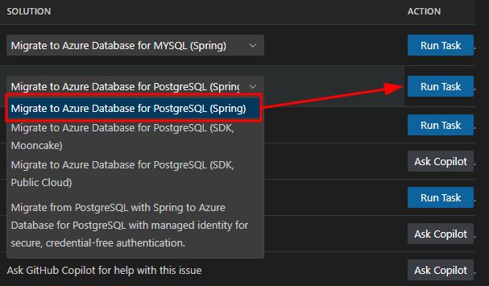

# Spring Boot PetClinic Migration & Modernization Workshop

This workshop demonstrates how to migrate and modernize the iconic Spring Boot PetClinic application from local execution to cloud deployment on Azure AKS Automatic. Participants will experience the complete modernization journey using AI-powered tools: GitHub Copilot Application Modernization for Java and Containerization Assist.

## 🎯 Workshop Goals

- **Simulate On-Prem Execution**: Run [Spring Boot PetClinic](https://github.com/spring-projects/spring-petclinic) locally with PostgreSQL using basic authentication
- **Code Modernization**: Use [GitHub Copilot Application Modernization for Java](https://marketplace.visualstudio.com/items?itemName=vscjava.vscode-java-upgrade) to modernize authentication for Azure
- **Cloud Migration**: Migrate from local Postgres to [Azure PostgreSQL Flexible Server](https://learn.microsoft.com/azure/postgresql/flexible-server/) with [Entra ID authentication](https://learn.microsoft.com/en-us/azure/active-directory/)
- **Containerization**: Use [Containerization Assist](https://marketplace.visualstudio.com/items?itemName=ms-kubernetes-tools.aks-devx-tools) to generate Docker and Kubernetes manifests for deployment
- **AKS Deployment**: Deploy to [AKS Automatic](https://learn.microsoft.com/azure/aks/automatic/) with [workload identity](https://learn.microsoft.com/en-us/azure/aks/workload-identity-overview) and [service connector](https://learn.microsoft.com/azure/service-connector/)

## 📁 Workshop Structure

```
mm-springboot-petclinic-to-aks-automatic/
├── README.md                           # This file - Complete workshop guide
├── plan.md                             # Detailed workshop plan (temporary)
├── scripts/                            # Automation scripts
│   ├── quickstart.sh                  # One-command workshop setup
│   └── setup-azure-infrastructure.sh  # Azure resource creation
├── src/                                # Spring Boot PetClinic application (created during setup)
├── manifests/                          # Generated Kubernetes manifests (placeholder)
├── config/                             # Configuration files (placeholder)
└── .env                               # Environment variables (created during setup)
```

## 🚀 Quick Start

### Prerequisites Check
Ensure you have the following tools installed and available:
- Azure CLI (logged in with `az login`)
- Java 17 or 21
- Maven 3.8+
- Docker Desktop
- VS Code with Java Extension Pack
- GitHub Copilot App Modernization extension
- kubectl
- Bash/Zsh shell (macOS or WSL2)

### Module 1: Setup Petclinic locally and test

1. Run the automated setup script:
   ```bash
   chmod +x scripts/*.sh
   ./scripts/quickstart.sh
   ```

2. Test the Spring Petclinic application locally using self-hosted Postgres:
   ```bash
   # Check if PostgreSQL container is running
   docker ps | grep petclinic-postgres
   
   # Test the application with all configuration
   cd src
   mvn spring-boot:run -Dspring-boot.run.arguments="--spring.messages.basename=messages/messages --spring.datasource.url=jdbc:postgresql://localhost/petclinic --spring.sql.init.mode=always --spring.sql.init.schema-locations=classpath:db/postgres/schema.sql --spring.sql.init.data-locations=classpath:db/postgres/data.sql --spring.jpa.hibernate.ddl-auto=none"
   cd ..
   
   # Wait for application to fully start
   echo "⏳ Waiting 30 seconds for application to start..."
   sleep 30

   # Open in browser for manual verification
   open http://localhost:8080
   ```

**💡 Explore the PetClinic Application:**
Once the application is running in your browser, take some time to explore the functionality:
- **Find Owners**: Go to "FIND OWNERS" → leave the "Last Name" field blank → click "Find Owner" to see all 10 owners
- **View Owner Details**: Click on an owner like "Betty Davis" to see their information and pets
- **Edit Pet Information**: From an owner's page, click "Edit Pet" to see how pet details are managed
- **Review Veterinarians**: Navigate to "VETERINARIANS" to see the 6 vets with their specialties (radiology, surgery, dentistry)

3. Next, let's open the Petclinic project in VS Code and begin our modernization work:
   ```bash
   code src/
   ```

---

### Module 2: Application Modernization
**What You'll Do:** Use GitHub Copilot Application Modernization for Java to assess, remediate, and modernize the Spring Boot application
**What You'll Learn:** How AI-powered modernization tools work, best practices for upgrading legacy applications, and the modernization workflow

**Detailed Steps:**

### Step 1: Select the GitHub App Modernization Extension
After VS Code opens with the Spring PetClinic project in focus, select the GitHub App Modernization for Java extension from the Activity Bar (cloud icon with J and arrows)


### Step 2: Navigate the Extension Interface
You'll see the extension interface with two main sections: "QUICKSTART" and "ASSESSMENT". Click "Migrate to Azure" to begin the modernization process


### Step 3: Grant MCP Server Permission
This opens GitHub Copilot chat in agent mode, asking for permission to start the App Modernization for Java MCP server. Click "Allow" to grant permission and continue with the assessment


### Step 4: Execute Precheck Assessment
The tool will execute "appmod-precheck-assessment" and show successful completion


### Step 5: Review Generated Artifacts
A .github folder is created to store modernization artifacts and logs


   
### Step 6: Review AppCAT Configuration Options
Scroll down in the GitHub Copilot chat to see the AppCAT tool configuration. [AppCAT for Java](https://learn.microsoft.com/en-us/azure/migrate/appcat/java?view=migrate-classic) is Azure Migrate's application and code assessment tool that App Mod for Java uses to perform static code analysis against your Java workload. It uses advanced analysis techniques to understand your application's structure and dependencies, identifying replatforming and migration opportunities for Azure.

The tool offers various targets including `azure-aks` for AKS deployment, `openjdk17` for Java 17 upgrade, and `cloud-readiness` for Azure optimization. Analysis modes include `source-only` for code analysis or `full` for code and dependency analysis.

**What AppCAT Does:**
- **Discovers technology usage** in your legacy applications
- **Assesses code for specific Azure targets** (AKS, App Service, Container Apps)
- **Identifies modifications needed** to replatform to Azure
- **Provides Azure-specific replatforming rules** and best practices


#### Configure Assessment Parameters
In the GitHub Copilot chat, you'll see the "Run `appmod-run-assessment`" tool with configuration options. This is where you can customize the assessment targets and analysis mode. 

   **Default Configuration:**
   ```json
   {
     "workspacePath": "<path to project>/src",
     "appCatConfig": {
       "target": ["azure-aks", "azure-appservice", "azure-container-apps", "cloud-readiness"],
       "mode": "source-only"
     }
   }
   ```

   **For AKS-focused migration, update to:**
   ```json
   {
     "workspacePath": "<path to project>/src",
     "appCatConfig": {
       "target": ["azure-aks", "cloud-readiness"],
       "mode": "source-only"
     }
   }
   ```

   **What this means:**
   - **`azure-aks`**: Targets AKS-specific modernization rules and best practices
   - **`cloud-readiness`**: Focuses on general Azure cloud optimization
   - **`mode: "source-only"**: Analyzes source code without dependency scanning (faster)

   **Action:** Either modify the JSON in the Input section or copy-paste the AKS-focused configuration above.
    
   

### Step 7: Execute Assessment
Click the "Run" button to start the AppCAT assessment. The tool will analyze your Spring Boot PetClinic application using the configured parameters.

> **Note:** The assessment process may take a few minutes to complete as it thoroughly analyzes your codebase against 935+ rules. This is normal - grab a coffee while it runs! ☕

### Step 8: Review Assessment Results
After the assessment completes, you'll see a success message in the GitHub Copilot chat summarizing what was accomplished:


**What the assessment accomplished:**
- **Prerequisites Verified**: AppCAT CLI environment setup and validation
- **Configuration Applied**: Assessment performed with `azure-aks` and `cloud-readiness` targets
- **Analysis Executed**: Processed 838 rules out of 935 total rules
- **Report Generated**: Assessment report opened in webview interface

### Step 9: Review Detailed Assessment Report
The assessment report opens in VS Code showing detailed findings:


**Key sections to review:**
- **Issue Summary**: 8 cloud readiness issues, 1 Java upgrade issue
- **Solution Coverage**: 54% of issues can be resolved via Microsoft solutions
- **Cloud Readiness Issues**: Database migration recommendations for Azure PostgreSQL
- **Criticality Levels**: Mandatory (purple), Potential (blue), Optional (gray)

**Next steps from the report:**
- Review identified issues and their severity levels
- Use Microsoft solutions for 54% of issues
- Leverage GitHub Copilot for remaining issues
- Plan your migration based on findings

### Step 10: Review Specific Findings
Click on individual issues in the report to see detailed recommendations. For this lab, we'll focus on the key findings:

   **Primary Focus - Database Migration (PostgreSQL):**
   - **Issue**: PostgreSQL database found in configuration files
   - **Files affected**: `pom.xml`, `build.gradle`, `application.properties`, `application-postgres.properties`
   - **Recommendation**: Migrate to Azure Database for PostgreSQL Flexible Server
   - **Action**: Use Azure Database Migration Service (DMS) for online migration with minimal downtime

   **Security Finding - Local Credentials:**
   - **Issue**: Passwords found in plaintext configuration files
   - **Files affected**: `application-mysql.properties`, `application-postgres.properties`, `application.properties`
   - **Recommendation**: Migrate from plaintext credentials to Azure Key Vault
   - **Action**: Implement passwordless connections using Entra ID authentication

   **Caching Finding - Embedded Cache Management:**
   - **Issue**: Spring Boot Cache library embedded in application
   - **File affected**: `pom.xml` (Line 50)
   - **Recommendation**: Migrate to Azure Cache for Redis
   - **Action**: Replace embedded cache with backing service

   **Note**: While the report identifies multiple issues, this lab will focus on the PostgreSQL migration to Azure Database for PostgreSQL Flexible Server with Entra AD authentication, and the embedded cache migration to Azure Cache for Redis. Additional security findings will be addressed in future lab modules.

### Step 11: Take Action on Findings
The assessment report offers two types of migration actions based on AppCAT findings:

- **Guided migration (blue "Migrate" button)**: For findings that GitHub Copilot Application Modernization for Java can currently automate, click the blue "Migrate" button to trigger a curated remediation flow with step-by-step guidance.
- **Unguided migration ("Ask Copilot" button)**: For findings that are not yet automated by the GitHub Copilot Application Modernization for Java tooling, use the "Ask Copilot" button to work directly with GitHub Copilot in agent mode using ready-to-use prompts that reference the specific finding, affected files, and target Azure service.


**For this lab, we will focus on modernizing the PetClinic workload by:**
- **Database Migration**: Migrating the self-hosted PostgreSQL database that uses basic authentication to Azure PostgreSQL Flexible Server using Entra ID authentication and AKS Workload Identity
- **Caching Migration**: Migrating from in-memory caching in Spring to Azure Cache for Redis, also using Entra ID authentication and AKS Workload Identity

### Step 12: Select PostgreSQL Migration Task
Begin the modernization by selecting the desired migration task. For our Spring Boot application, we will migrate to Azure PostgreSQL Flexible Server using the Spring option. The other options shown are for generic JDBC usage.



**Note:** Choose the "Spring" option for Spring Boot applications, as it provides Spring-specific optimizations and configurations. The generic JDBC options are for non-Spring applications.

### Step 13: Execute Postgres Migration Task
Click the "Migrate" button described in the previous section to kick off the modernization changes needed in the PetClinic app. This will update the Java code to work with PostgreSQL Flexible Server using Entra ID authentication.


The tool will execute the `appmod-run-task` command for `managed-identity-spring/mi-postgresql-spring`, which will examine the workspace structure and initiate the migration task to modernize your Spring Boot application for Azure PostgreSQL with managed identity authentication. If prompted to run shell commands, please review and allow each command as the Agent may require additional context before execution.

When the migration task for PostgreSQL with Entra ID authentication begins to run, you will see a chat similar to this in the agent interface:


### Step 14: Review Migration Plan and Begin Code Migration
After the migration task initializes, a comprehensive migration plan summary will be provided, outlining the key changes the tool will make to your application. This plan focuses on integrating Azure Managed Identity with PostgreSQL.

**Migration Plan Summary:**
The plan will detail the following key changes:
- **Add Spring Cloud Azure Dependencies**: Adding Spring Cloud Azure BOM version 5.22.0 (compatible with Spring Boot 3.x) and the `spring-cloud-azure-starter-jdbc-postgresql` dependency to both `pom.xml` and `build.gradle`
- **Configure Managed Identity Authentication**: Updating `application.properties` and `application-postgres.properties` to replace username/password authentication with managed identity, add Azure managed identity configuration properties, and enable passwordless authentication

**Files to be Modified:**
- `pom.xml` - Add Spring Cloud Azure dependencies
- `build.gradle` - Add Spring Cloud Azure dependencies  
- `application.properties` - Configure managed identity
- `application-postgres.properties` - Configure managed identity

**Tracking Files Created:**
The tool will create `plan.md` and `progress.md` files in the `.github/appmod-java/code-migration/managed-identity-spring/mi-postgresql-spring-[timestamp]` directory to track what changes are made and why, providing full visibility into the migration process.

**Configuration Settings:**
- VS Code uncommitted changes policy: `Always Stash` (will auto-stash any uncommitted changes)
- New branch will be created for the migration work
- Migration session ID will be provided for tracking

**To Begin the Migration:**
When you're ready to proceed with the PostgreSQL code migration work, type **"Yes"** in the GitHub Agent Chat to begin the automated code changes.

### Step 15: Review Migration Process and Progress Tracking
Once you confirm with "Yes", the migration tool will begin implementing the changes in a structured, two-phase approach. The tool creates a dedicated Git branch for all migration changes to facilitate easy rollback if needed.

**Version Control Setup:**
The tool automatically handles version control by:
- Stashing any uncommitted changes (like `application.properties` modifications)
- Creating a new branch: `appmod/java-managed-identity-spring/mi-postgresql-spring-[timestamp]`
- Ensuring a clean working directory before making changes

**Two-Phase Migration Process:**
This particular migration task has chosen to break up the work into two distinct phases to ensure a systematic and reliable modernization approach. By separating dependency updates from configuration changes, the tool can validate each phase independently and provide better error handling and rollback capabilities.

**Phase 1: Update Dependencies**
- Updates `pom.xml` with Spring Cloud Azure BOM and PostgreSQL starter dependency
- Updates `build.gradle` with corresponding Gradle dependencies
- Adds Spring Cloud Azure version properties

**Phase 2: Configure Application Properties**
- Updates `application.properties` to configure PostgreSQL with managed identity (9 lines added, 2 removed)
- Updates `application-postgres.properties` with Entra ID authentication settings (5 lines added, 4 removed)
- Replaces username/password authentication with managed identity configuration

**Progress Tracking:**
The `progress.md` file is continuously updated throughout the migration process, providing a detailed log of:
- What changes are being made and why
- Which files are being modified
- The rationale behind each modification
- Real-time status of the migration work

This approach ensures full transparency and traceability of all automated changes made to modernize your Spring Boot application for Azure PostgreSQL with Entra ID authentication.

**Validation & Fix Iteration Loop:**
After the migration changes are implemented, the tool automatically enters a validation and fix iteration loop to ensure the application builds successfully. This process includes:

- **CVE Validation**: The tool identifies newly added dependencies and checks for known Common Vulnerabilities and Exposures (CVEs)
- **Build Validation**: Attempts to build the project and captures any compilation or dependency errors
- **Automated Fixes**: Uses error output to automatically attempt fixes for common issues
- **Iterative Process**: Continues through multiple validation cycles (up to 10 iterations) until the build succeeds


**User Control:**
At any point during this validation process, you can interrupt the automated fixes and manually resolve issues if you prefer to handle specific problems yourself. The tool provides clear feedback on what it's attempting to fix and allows you to take control when needed.

### Step 16: Review Validation & Fix Loop Results
The validation process progresses through multiple stages, each designed to ensure the migration changes are secure, functional, and consistent. Here's what happens during the validation loop:

**Stage 1: CVE Validation** ✅
- **Result**: No CVEs detected in the new Spring Cloud Azure dependencies
- **Action**: No changes made - security scan passed

**Stage 2: Build Validation** ✅
- **Result**: Build successful after migration changes
- **Action**: No changes made - project compiles successfully

**Stage 3: Consistency Validation** ✅
- **Result**: No consistency issues detected
- **Details**: All changes properly implement Azure Managed Identity for PostgreSQL as specified in the knowledge base
- **Files Validated**: 
  - `pom.xml` - Correctly updated with Azure dependencies
  - `application-postgres.properties` - Properly configured for passwordless authentication
  - `application.properties` - Successfully migrated from H2 to PostgreSQL with managed identity

**Stage 4: Test Validation** ⚠️
- **Issue Detected**: Tests failed with compile errors
- **Error Details**: Maven Surefire plugin failure during test execution
- **Automatic Response**: The tool automatically detects these errors from the build output and initiates debugging

**Automatic Error Detection & Debugging:**
The App Modernization tool doesn't stop when errors occur. Instead, it:
- Automatically parses error messages from build outputs
- Identifies the root cause of compilation or test failures
- Attempts to fix common issues automatically
- Continues through additional validation iterations until all issues are resolved

This intelligent error detection and debugging capability ensures that your application is fully functional after the migration, with all tests passing and no security vulnerabilities introduced.


---

### Module 3: Deploy Azure Infrastructure
**What You'll Do:** Create all required Azure resources using automated scripts
**What You'll Learn:** Azure resource management, PostgreSQL Flexible Server, AKS Automatic, and workload identity concepts

**Detailed Steps:**
1. Run the Azure infrastructure setup script:
   ```bash
   ./scripts/setup-azure-infrastructure.sh
   ```

2. Verify all resources are created successfully:
   ```bash
   # Check resource group
   az group show --name petclinic-workshop-rg
   
   # Check PostgreSQL server
   az postgres flexible-server list --resource-group petclinic-workshop-rg
   
   # Check AKS cluster
   az aks list --resource-group petclinic-workshop-rg
   ```

3. Configure application for Azure PostgreSQL:
   ```bash
   # Source environment variables
   source .env
   
   # Create Azure-specific application properties
   cat > src/src/main/resources/application-azure.properties << EOF
   spring.datasource.url=jdbc:postgresql://${POSTGRES_SERVER}:5432/petclinic?sslmode=require
   spring.datasource.username=${POSTGRES_USER}
   spring.datasource.password=${POSTGRES_PASSWORD}
   spring.datasource.driver-class-name=org.postgresql.Driver
   spring.jpa.hibernate.ddl-auto=create-drop
   spring.jpa.properties.hibernate.dialect=org.hibernate.dialect.PostgreSQLDialect
   spring.jpa.show-sql=true
   spring.jpa.properties.hibernate.format_sql=true
   EOF
   ```

**What this creates:**
- Resource group: `petclinic-workshop-rg`
- Azure PostgreSQL Flexible Server
- AKS Automatic cluster with workload identity
- Azure Container Registry
- Service connector between AKS and PostgreSQL

**Expected Result**: All Azure resources created and configured with workload identity and service connector.

---

### Module 4: Generate Containerization Assets
**What You'll Do:** Use Containerization Assist to create Docker and Kubernetes manifests
**What You'll Learn:** How AI-powered tools can generate production-ready containerization assets

**Detailed Steps:**
1. Configure Containerization Assist for the application:
   - In VS Code, open Command Palette
   - Select "Containerization Assist: Generate Dockerfile and Kubernetes Manifests"

2. Generate optimized Dockerfile:
   - Follow the guided process
   - Configure for Spring Boot application
   - Set appropriate base image and optimizations

3. Create Kubernetes deployment manifests:
   - Generate deployment, service, and ingress configurations
   - Configure health checks and readiness probes
   - Set up service configuration for internal communication

4. Review and validate generated assets:
   ```bash
   # Check generated Dockerfile
   cat Dockerfile
   
   # Check generated Kubernetes manifests
   ls -la manifests/
   cat manifests/deployment.yaml
   cat manifests/service.yaml
   ```

**Expected Result**: Production-ready Dockerfile and Kubernetes manifests generated by AI tools.

---

### Module 5: Deploy to AKS
**What You'll Do:** Deploy the modernized application to Azure Kubernetes Service
**What You'll Learn:** Kubernetes deployment, service management, and testing deployed applications

**Detailed Steps:**
1. Apply Kubernetes manifests to AKS:
   ```bash
   # Apply Kubernetes manifests
   kubectl apply -f manifests/
   ```

2. Monitor deployment status:
   ```bash
   # Check deployment status
   kubectl get pods
   kubectl get services
   kubectl get deployments
   ```

3. Configure service access:
   ```bash
   # Port forward to local machine
   kubectl port-forward svc/petclinic-service 8080:80
   ```

4. Test the deployed application:
   ```bash
   # Test the application
   curl http://localhost:8080
   ```

5. Verify database connectivity:
   ```bash
   # Check pod logs for database connection
   kubectl logs <pod-name>
   ```

**Expected Result**: Application successfully deployed to AKS with generated Docker and Kubernetes manifests.

---

### Step 6: Cleanup Resources
**What You'll Do:** Remove all Azure resources and clean up local environment
**What You'll Learn:** Best practices for resource cleanup and cost management

**Detailed Steps:**
1. Remove Azure resource group:
   ```bash
   # Delete entire resource group (this will clean up all resources)
   az group delete --name petclinic-workshop-rg --yes --no-wait
   ```

2. Stop local containers:
   ```bash
   # Stop and remove local PostgreSQL container
   docker stop petclinic-postgres
   docker rm petclinic-postgres
   ```

3. Clean up local files:
   ```bash
   # Stop local application (if still running)
   pkill -f "spring-boot:run"
   ```

4. Verify cleanup completion:
   ```bash
   # Check if containers are stopped
   docker ps | grep petclinic
   
   # Check if application is stopped
   curl -s http://localhost:8080 || echo "Application stopped"
   ```

## 🧪 Testing & Validation

### Local Application Test
- ✅ Application accessible at http://localhost:8080
- ✅ Database connection working (check logs for Hibernate messages)
- ✅ Basic PetClinic functionality working

### Azure Infrastructure Test
- ✅ PostgreSQL server accessible from AKS
- ✅ AKS cluster running with workload identity enabled
- ✅ Service connector configured between AKS and PostgreSQL

### Deployed Application Test
- ✅ Application pods running successfully
- ✅ Service accessible via kubectl port-forward
- ✅ Application connecting to Azure PostgreSQL

## 🚨 Troubleshooting

### Common Issues & Solutions

#### PostgreSQL Connection Issues
```bash
# Check firewall rules
az postgres flexible-server firewall-rule list --resource-group petclinic-workshop-rg --name $POSTGRES_SERVER

# Check connection from AKS
kubectl exec -it <pod-name> -- nc -zv $POSTGRES_SERVER 5432
```

#### AKS Deployment Issues
```bash
# Check pod logs
kubectl logs <pod-name>

# Check pod status
kubectl describe pod <pod-name>

# Check service connector status
az webapp connection list --resource-group petclinic-workshop-rg
```

#### Workload Identity Issues
```bash
# Check federated identity credentials
az identity federated-credential list --identity-name petclinic-workshop-identity --resource-group petclinic-workshop-rg

# Verify OIDC issuer
az aks show --resource-group petclinic-workshop-rg --name petclinic-workshop-aks --query "oidcIssuerProfile.issuerUrl"
```

## 📋 Workshop Progress Checklist

### ✅ Pre-Workshop Setup
- [ ] Azure CLI installed and logged in
- [ ] Java 17 or 21 installed
- [ ] Maven 3.8+ installed
- [ ] Docker Desktop running
- [ ] VS Code with Java Extension Pack
- [ ] GitHub Copilot App Modernization extension installed
- [ ] kubectl installed
- [ ] Workshop repository cloned

### 🚀 Step 1: Automated Setup
- [ ] Run `./scripts/quickstart.sh`
- [ ] Verify `src/` directory created with PetClinic code
- [ ] Confirm PostgreSQL container running
- [ ] Test local application at http://localhost:8080
- [ ] Open project in VS Code: `code src/`

### 🔧 Step 2: Code Modernization
- [ ] Install GitHub Copilot App Modernization extension
- [ ] Run "GitHub Copilot: Modernize Java Application"
- [ ] Upgrade Spring Boot version
- [ ] Update dependencies and Java features
- [ ] Apply security updates
- [ ] Verify build success: `mvn clean compile`

### ☁️ Step 3: Azure Infrastructure
- [ ] Run infrastructure setup: `./scripts/setup-azure-infrastructure.sh`
- [ ] Verify resource group created
- [ ] Confirm PostgreSQL Flexible Server running
- [ ] Check AKS Automatic cluster status
- [ ] Verify service connector configured
- [ ] Update application properties for Azure

### 🐳 Step 4: Containerization Assets
- [ ] Use Containerization Assist to generate Dockerfile
- [ ] Generate Kubernetes manifests
- [ ] Review generated files
- [ ] Validate containerization assets

### 🚀 Step 5: Deploy to AKS
- [ ] Deploy to AKS: `kubectl apply -f manifests/`
- [ ] Check deployment status
- [ ] Test deployed application via port-forward
- [ ] Verify connection to Azure PostgreSQL

### 🧹 Step 6: Cleanup Resources
- [ ] Clean up Azure resources: `az group delete --name petclinic-workshop-rg --yes --no-wait`
- [ ] Stop local PostgreSQL container
- [ ] Stop local application
- [ ] Review workshop accomplishments

## 🎯 Workshop Deliverables
- ✅ Locally running PetClinic with PostgreSQL container
- ✅ Modernized codebase using GitHub Copilot
- ✅ Azure PostgreSQL with Entra ID authentication
- ✅ AKS Automatic cluster with workload identity
- ✅ Containerized application deployed and accessible
- ✅ Secure service connector between AKS and PostgreSQL

## 🔧 Key Technologies

- **Spring Boot PetClinic**: The application to modernize
- **Azure PostgreSQL Flexible Server**: Cloud database with Entra ID auth
- **AKS Automatic**: Managed Kubernetes with automated deployments
- **[GitHub Copilot Application Modernization for Java](https://marketplace.visualstudio.com/items?itemName=vscjava.vscode-java-upgrade)**: AI-powered Java application modernization
- **[Containerization Assist](https://marketplace.visualstudio.com/items?itemName=ms-kubernetes-tools.aks-devx-tools)**: AI-powered Docker and K8s manifest generation
- **Workload Identity**: Passwordless authentication between AKS and Azure services
- **Service Connector**: Secure connection between AKS and PostgreSQL

## 🧹 Cleanup

To clean up all Azure resources:
```bash
az group delete --name petclinic-workshop-rg --yes --no-wait
```

To clean up local resources:
```bash
docker stop petclinic-postgres && docker rm petclinic-postgres
```

## 🔗 Resources

- [Spring Boot PetClinic](https://github.com/spring-projects/spring-petclinic)
- [GitHub Copilot Application Modernization for Java](https://marketplace.visualstudio.com/items?itemName=vscjava.vscode-java-upgrade)
- [Containerization Assist](https://marketplace.visualstudio.com/items?itemName=ms-kubernetes-tools.aks-devx-tools)
- [AKS Automatic Documentation](https://learn.microsoft.com/en-us/azure/aks/automatic/)
- [Azure PostgreSQL Flexible Server](https://learn.microsoft.com/en-us/azure/postgresql/flexible-server/)
- [Azure Workload Identity](https://learn.microsoft.com/en-us/azure/aks/workload-identity-overview)

## 🆘 Support

If you encounter issues during the workshop:
1. Check the troubleshooting section above
2. Verify all prerequisites are installed and working
3. Check Azure portal for resource health and diagnostics
4. Use `kubectl logs` to debug application issues

## 📝 Notes

- This workshop is designed for a 90-minute session
- All Azure resources use fixed naming conventions
- PostgreSQL server names include a random 6-character suffix
- The workshop focuses on the migration experience, not troubleshooting
- Containerization Assist will generate the actual Docker and K8s files

## 📝 Workshop Notes & Observations
- **What worked well:**
- **Challenges encountered:**
- **Key learnings:**
- **Next steps to explore:**

---

**Workshop completed on:** ___________  
**Total time taken:** ___________  
**Overall experience:** ⭐⭐⭐⭐⭐

---

**Happy modernizing! 🚀**
